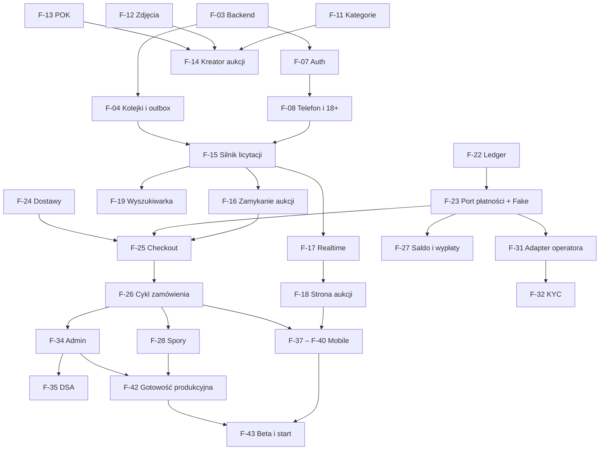

# Biddy — lista Feature Specs

> **Wersja:** 0.1 · **Data:** 2026-10-07 · **Powiązany dokument:** [PROJECT.md](PROJECT.md) (odwołania „§” dotyczą tego dokumentu)
>
> Projekt jest rozbity na **43 feature specy dla MVP**, pogrupowane w 5 etapów zgodnych z roadmapą (§20), oraz listę funkcji po MVP. Każdy spec poniżej to **wersja skrócona**: cel, zakres, kryteria akceptacji, zależności. Pełny spec piszemy tuż przed implementacją (just-in-time) według [szablonu](#szablon-pełnego-feature-specu) w pliku `docs/features/F-XX-nazwa.md`.

---

## Spis treści

1. [Jak pracujemy z feature specami](#jak-pracujemy-z-feature-specami)
2. [Przegląd i szacunki](#przegląd-i-szacunki)
3. [Zależności](#zależności)
4. [Etap 0: Fundamenty](#etap-0-fundamenty)
5. [Etap 1: Rdzeń licytacji](#etap-1-rdzeń-licytacji)
6. [Etap 2a: Transakcje (niezależne od operatora płatności)](#etap-2a-transakcje-niezależne-od-operatora-płatności)
7. [Etap 2b: Integracja operatora i operacje](#etap-2b-integracja-operatora-i-operacje)
8. [Etap 3: Mobile i start](#etap-3-mobile-i-start)
9. [Po MVP](#po-mvp)
10. [Szablon pełnego feature specu](#szablon-pełnego-feature-specu)

---

## Jak pracujemy z feature specami

**Rozmiary** (osobodni jednego developera, z testami):

| Rozmiar | Szacunek |
|---|---|
| `S` | ok. 2 dni |
| `M` | ok. 5 dni |
| `L` | ok. 10 dni |

Szacunki są zgrubne. Skalibruj je po pierwszych 2–3 featurach, mierząc rzeczywisty czas.

**Statusy:** `Szkic` → `Gotowy do pracy` → `W trakcie` → `Review` → `Zrobione`.

### Definition of Ready (zanim zaczniemy feature)

- Pełny spec w `docs/features/F-XX-nazwa.md` według szablonu.
- Zależności ukończone albo zastąpione fake'ami lub mockami.
- Otwarte pytania rozstrzygnięte (albo świadomie odłożone z domyślną decyzją).
- Dla funkcji z UI: szkic lub wireframe ekranów i stanów (pusty, ładowanie, błąd).

### Definition of Done (żeby uznać feature za skończony)

- Wszystkie kryteria akceptacji spełnione i pokryte testami (jednostkowe, integracyjne; e2e dla ścieżek krytycznych).
- Migracje bazy wstecznie kompatybilne.
- OpenAPI i wygenerowany klient zaktualizowane.
- Eventy analityczne (PostHog) dodane dla kluczowych akcji.
- Błędy trafiają do Sentry, logi mają kontekst (request id, user id).
- Dostępność: obsługa klawiaturą, kontrast, etykiety pól.
- Teksty przez `next-intl` / i18n, bez tekstów na sztywno w kodzie.
- Wdrożone na staging i sprawdzone ręcznie.
- Jeśli zmieniła się decyzja projektowa: aktualizacja PROJECT.md lub nowy ADR.

---

## Przegląd i szacunki

| Etap | Feature specy | Osobodni |
|---|---|---:|
| 0: Fundamenty | F-01 – F-09 | 33 |
| 1: Rdzeń licytacji | F-10 – F-21 | 66 |
| 2a: Transakcje (niezależne od operatora) | F-22 – F-30 | 57 |
| 2b: Integracja operatora i operacje | F-31 – F-36 | 40 |
| 3: Mobile i start | F-37 – F-43 | 45 |
| **Razem MVP** | **43** | **241** |

### ⚠️ Szacunki vs roadmapa

Roadmapa w PROJECT.md (§20) zakłada start MVP po ok. **5 miesiącach** (20 tygodni). Suma szacunków z tego rozbicia daje więcej:

| Wariant | 2 developerów | 1 developer |
|---|---|---|
| Web + mobile na start (241 osobodni) | ok. 24 tyg. pracy + bufor 15–20% ≈ **6–7 miesięcy** | ≈ **11–13 miesięcy** |
| Web na start, mobile zaraz po (211 osobodni do startu) | ok. 21 tyg. + bufor ≈ **5,5–6 miesięcy**, aplikacje ok. 1–1,5 mies. później | ≈ **10–11 miesięcy** |

**Rekomendacja:** start **web-first** (RWD, wystawianie z telefonu przez przeglądarkę z dostępem do aparatu), a aplikacje mobilne (F-37 – F-40) jako szybka kontynuacja. Web daje też SEO i szybsze iteracje w becie. Alternatywnie: zostawić pełny zakres i przesunąć termin startu. **Do decyzji przed aktualizacją roadmapy.**

### Lista MVP

| ID | Feature | Etap | Rozmiar |
|---|---|---|---|
| F-01 | Monorepo i narzędzia | 0 | S |
| F-02 | Środowisko lokalne | 0 | S |
| F-03 | Szkielet backendu | 0 | M |
| F-04 | Kolejki, workery i outbox | 0 | M |
| F-05 | Kontrakt API i generowany klient | 0 | S |
| F-06 | Szkielet aplikacji web | 0 | M |
| F-07 | Rejestracja i logowanie | 0 | M |
| F-08 | Weryfikacja telefonu i 18+ | 0 | S |
| F-09 | CI/CD i środowiska | 0 | M |
| F-10 | Profil i adresy | 1 | S |
| F-11 | Kategorie i atrybuty | 1 | M |
| F-12 | Zdjęcia: upload i przetwarzanie | 1 | M |
| F-13 | Kalkulator POK i cenniki | 1 | S |
| F-14 | Kreator aukcji (web) | 1 | L |
| F-15 | Silnik licytacji | 1 | L |
| F-16 | Zamykanie aukcji | 1 | M |
| F-17 | Realtime | 1 | M |
| F-18 | Strona aukcji | 1 | M |
| F-19 | Wyszukiwarka i przeglądanie | 1 | L |
| F-20 | Obserwowane i powiadomienia | 1 | M |
| F-21 | Moje Biddy | 1 | S |
| F-22 | Ledger | 2a | M |
| F-23 | Port płatności i FakeGateway | 2a | M |
| F-24 | Dostawy | 2a | L |
| F-25 | Checkout (web) | 2a | M |
| F-26 | Cykl życia zamówienia | 2a | L |
| F-27 | Saldo i wypłaty | 2a | M |
| F-28 | Spory i zwroty | 2a | L |
| F-29 | Wiadomości | 2a | M |
| F-30 | Oceny | 2a | S |
| F-31 | Adapter operatora płatności | 2b | L |
| F-32 | Weryfikacja sprzedawców u operatora | 2b | M |
| F-33 | Uzgodnienia z operatorem | 2b | M |
| F-34 | Panel administracyjny v1 | 2b | L |
| F-35 | Zgłoszenia i moderacja (DSA) | 2b | M |
| F-36 | Antyfraud: reguły podstawowe | 2b | M |
| F-37 | Aplikacja mobilna: fundament | 3 | M |
| F-38 | Mobile: przeglądanie i licytowanie | 3 | L |
| F-39 | Mobile: wystawianie z aparatem | 3 | M |
| F-40 | Mobile: transakcje i komunikacja | 3 | L |
| F-41 | Treści prawne i strony pomocy | 3 | M |
| F-42 | Gotowość produkcyjna | 3 | M |
| F-43 | Beta i publikacja w sklepach | 3 | M |

### Podział pracy przy 2 osobach

- **Osoba A (backend i domena):** fundamenty backendu, silnik licytacji, zamykanie aukcji, realtime, ledger, płatności, dostawy, cykl zamówienia, antyfraud.
- **Osoba B (produkt i frontend):** szkielet web, auth UI, kreator, strona aukcji, wyszukiwarka (UI), Moje Biddy, checkout, wiadomości, panel admina, potem aplikacja mobilna.

Feature'y są full-stackowe, więc to podział „kto prowadzi”, a nie sztywny podział warstw.

---

## Zależności

Ścieżka krytyczna: **F-03 → F-04 → F-15 → F-16 → F-25 → F-26 → F-28 / F-34 → F-42 → F-43**. Opóźnienie na tej ścieżce przesuwa start.



---

## Etap 0: Fundamenty

### F-01 · Monorepo i narzędzia · `S`

**Cel:** wspólna baza kodu dla wszystkich aplikacji i pakietów.

**Zakres:**
- Turborepo + pnpm workspaces, struktura `apps/` i `packages/` (§12).
- `packages/config`: tsconfig, ESLint, Prettier (lub Biome).
- `packages/shared`: typ `Money` i helpery kwot (grosze, procent z zaokrągleniem half-up, formatowanie PLN).
- Vitest jako runner testów.

**Kryteria akceptacji:**
- `pnpm install && pnpm build && pnpm lint && pnpm test` z katalogu głównego przechodzi.
- Zmiana w `packages/shared` przebudowuje tylko zależne aplikacje (cache Turborepo).
- Helpery `Money` mają testy, w tym zaokrągleń.

**Zależności:** — · **Spec:** §11.1, §12

### F-02 · Środowisko lokalne · `S`

**Cel:** każda osoba uruchamia cały projekt lokalnie jedną komendą.

**Zakres:**
- `infra/docker-compose.yml`: Postgres, Redis, Meilisearch, MinIO, Mailpit.
- `.env.example` i walidacja zmiennych.
- Skrypty `pnpm dev`, `pnpm db:reset`, seed z użytkownikami testowymi.
- README z instrukcją startu.

**Kryteria akceptacji:**
- Nowa osoba uruchamia projekt według README w mniej niż 15 minut.
- `pnpm db:reset` odtwarza bazę z migracji i seeda.
- Maile wysyłane lokalnie trafiają do Mailpit.

**Zależności:** F-01 · **Spec:** §12

### F-03 · Szkielet backendu · `M`

**Cel:** gotowa struktura NestJS, na której budujemy wszystkie moduły.

**Zakres:**
- NestJS z adapterem Fastify, puste moduły według §10.3.
- Konfiguracja walidowana Zodem przy starcie.
- Drizzle ORM + drizzle-kit (migracje).
- Logger pino z request id, Sentry, health checks (`/health`, `/ready`).
- Błędy w formacie RFC 9457 z kodami domenowymi.
- OpenAPI pod `/docs`.
- Reguły granic modułów w lincie.
- Testy integracyjne z Testcontainers.

**Kryteria akceptacji:**
- Aplikacja nie startuje przy brakującej lub błędnej zmiennej środowiskowej.
- Błąd walidacji zwraca Problem Details z kodem domenowym.
- Import wewnętrznego pliku innego modułu kończy się błędem lintu.
- Test integracyjny z Testcontainers działa w CI.

**Zależności:** F-01, F-02 · **Spec:** §10, §11.2

### F-04 · Kolejki, workery i outbox · `M`

**Cel:** niezawodne przetwarzanie asynchroniczne i efekty uboczne, które się nie gubią.

**Zakres:**
- BullMQ, osobny entrypoint `worker.ts`.
- Tabela `outbox` i relay do kolejek.
- Konwencja eventów domenowych.
- Retry z backoffem, dead-letter queue.
- Joby cykliczne (pod sweepery).
- Bull Board w dev.

**Kryteria akceptacji:**
- Event z wycofanej transakcji nie zostaje opublikowany.
- Event z zatwierdzonej transakcji trafia do konsumenta co najmniej raz, także po restarcie workera.
- Konsument jest idempotentny: ponowne dostarczenie nie dubluje efektu (test).
- Job, który zawiódł N razy, trafia do DLQ i generuje zdarzenie w Sentry.

**Zależności:** F-03 · **Spec:** §10.1 (ADR-4), §10.4

### F-05 · Kontrakt API i generowany klient · `S`

**Cel:** typowany klient API dla web i mobile bez ręcznego pisania.

**Zakres:**
- DTO przez `nestjs-zod` → OpenAPI.
- orval → `packages/api-client` (fetcher z autoryzacją, hooki TanStack Query).
- Sprawdzenie w CI, czy klient jest aktualny.

**Kryteria akceptacji:**
- Zmiana DTO bez regeneracji klienta kończy się błędem CI.
- Web wywołuje przykładowy endpoint przez wygenerowany hook z pełnym typowaniem.

**Zależności:** F-03 · **Spec:** §11.1

### F-06 · Szkielet aplikacji web · `M`

**Cel:** baza aplikacji Next.js z design systemem.

**Zakres:**
- Next.js (App Router), Tailwind + shadcn/ui.
- `packages/design-tokens` jako preset Tailwind.
- Layout: nagłówek, miejsce na wyszukiwarkę, stopka.
- `next-intl` (PL), strony błędów i 404.
- Sentry, PostHog (włączany dopiero po zgodzie, patrz F-41), bazowe SEO (metadata, robots).

**Kryteria akceptacji:**
- Lighthouse ≥ 90 dla wydajności i dostępności na stronie głównej.
- Układ działa od 360 px do 1440 px bez poziomego przewijania.
- Kolory i typografia pochodzą wyłącznie z design tokens.

**Zależności:** F-01, F-05 · **Spec:** §11.3

### F-07 · Rejestracja i logowanie · `M`

**Cel:** bezpieczne konta użytkowników.

**Zakres:**
- Better Auth w NestJS (adapter Drizzle).
- E-mail i hasło z weryfikacją e-maila i resetem hasła, logowanie Google i Apple.
- Sesje cookie dla web (domena `.biddy.pl`), przygotowanie tokenów bearer dla mobile.
- Turnstile na rejestracji i logowaniu.
- Akceptacja regulaminu z zapisem wersji.
- Ekrany web, wylogowanie ze wszystkich urządzeń.

**Kryteria akceptacji:**
- Bez potwierdzonego e-maila nie można licytować ani wystawiać.
- Zapisana jest wersja zaakceptowanego regulaminu.
- Po 5 nieudanych logowaniach następuje czasowa blokada.
- Server Components w Next.js widzą zalogowanego użytkownika (SSR).

**Zależności:** F-03, F-06 · **Spec:** §4, §11.2

### F-08 · Weryfikacja telefonu i 18+ · `S`

**Cel:** jedno konto na osobę i podstawowa ochrona przed fałszywymi kontami.

**Zakres:**
- Kod SMS przez SMSAPI (adapter `SmsProvider` + fake w dev).
- Unikalność numeru, oświadczenie 18+.
- Guard `requireVerifiedPhone` dla licytowania i wystawiania.

**Kryteria akceptacji:**
- Jeden numer można przypisać tylko do jednego konta.
- Maks. 3 SMS-y na numer na godzinę, limit per IP.
- Kod ważny 5 minut, maks. 5 prób.
- Bez weryfikacji API licytacji zwraca `PHONE_NOT_VERIFIED`.

**Zależności:** F-07 · **Spec:** §4, §16

### F-09 · CI/CD i środowiska · `M`

**Cel:** automatyczne testy i wdrożenia od pierwszego tygodnia.

**Zakres:**
- GitHub Actions: lint, typecheck, testy, build z cache Turborepo.
- Staging: Render (API, worker, Postgres, Redis) i Vercel (web).
- Migracje jako osobny krok przed deployem, sekrety, preview deployments dla web, Sentry releases.

**Kryteria akceptacji:**
- Merge do `main` wdraża staging automatycznie w mniej niż 15 minut.
- Nieudana migracja zatrzymuje deploy bez wpływu na działającą wersję.
- Każdy PR ma preview aplikacji web.

**Zależności:** F-03, F-06 · **Spec:** §18

---

## Etap 1: Rdzeń licytacji

### F-10 · Profil i adresy · `S`

**Cel:** użytkownik zarządza swoim profilem i adresami dostaw.

**Zakres:**
- Edycja profilu: nazwa wyświetlana, avatar.
- Publiczny profil: data dołączenia, aktywne aukcje, miejsce na oceny (F-30).
- Adresy: dodawanie, edycja, usuwanie, adres domyślny, walidacja kodu pocztowego.

**Kryteria akceptacji:**
- Publiczny profil nie ujawnia e-maila, telefonu ani adresu.
- Użytkownik ma maksymalnie jeden adres domyślny.

**Zależności:** F-07 (avatar: F-12) · **Spec:** §13.3

### F-11 · Kategorie i atrybuty · `M`

**Cel:** drzewo kategorii z atrybutami zależnymi od kategorii (np. rozmiar dla mody, model dla elektroniki).

**Zakres:**
- Drzewo kategorii (`ltree`), atrybuty jako JSON Schema per kategoria, dziedziczone z kategorii nadrzędnej.
- Seed głównych kategorii: moda, elektronika, dom, RTV, AGD, kolekcjonerstwo i inne.
- Flagi: kategoria z ograniczeniami, kategoria „brand-sensitive”.
- API kategorii, walidacja atrybutów w backendzie.
- Komponent formularza generowanego ze schematu (web).

**Kryteria akceptacji:**
- Kategoria-liść dziedziczy atrybuty kategorii nadrzędnych.
- Przedmiot z niepoprawnymi atrybutami jest odrzucany z czytelnym błędem.
- Zmiana schematu kategorii nie psuje istniejących przedmiotów.

**Zależności:** F-03 · **Spec:** §13.3

### F-12 · Zdjęcia: upload i przetwarzanie · `M`

**Cel:** bezpieczny upload zdjęć z ochroną prywatności i moderacją.

**Zakres:**
- Presigned URL do R2/MinIO z limitem typu i rozmiaru.
- Job przetwarzania: ponowne kodowanie, usunięcie EXIF (w tym GPS), warianty rozmiarów.
- Moderacja obrazów (adapter + fake), kolejność zdjęć.
- Czyszczenie osieroconych plików.

**Kryteria akceptacji:**
- Przetworzone zdjęcie nie zawiera metadanych EXIF (test).
- Plik za duży lub niebędący obrazem jest odrzucany.
- Zdjęcie oznaczone przez moderację nie jest publicznie widoczne i trafia do kolejki moderacji.
- Osierocone uploady są usuwane po 24 h.

**Zależności:** F-04 · **Spec:** §16.1

### F-13 · Kalkulator POK i cenniki · `S`

**Cel:** jedna, wspólna logika opłat i kroków przebicia dla frontu i backendu.

**Zakres:**
- Tabela `fee_schedules` (wersjonowana, z progami i capem).
- `calculatePok()` i tabela przebić w `packages/shared`.
- Komponent „cena łączna”: *licytujesz X · zapłacisz Y + dostawa od Z*.

**Kryteria akceptacji:**
- Wyniki zgodne z przykładami z §3.2 (testy).
- Zaokrąglenie half-up do grosza.
- Zmiana cennika nie wpływa na istniejące zamówienia (zamówienie pamięta `fee_schedule_id`).

**Zależności:** F-01, F-03 · **Spec:** §3.1, §6.3

### F-14 · Kreator aukcji (web) · `L`

**Cel:** sprzedający wystawia przedmiot na licytację w kilka minut.

**Zakres:**
- Kroki: zdjęcia → kategoria i atrybuty → tytuł, opis, stan → gabaryt i przewoźnicy → parametry (cena wywoławcza, czas trwania, cena minimalna, Kup teraz) → podgląd → publikacja.
- Autozapis szkicu.
- Edycja przed pierwszą ofertą, anulowanie według reguł §6.6.
- Limity dla nowych kont.
- Informacja o weryfikacji tożsamości przed pierwszym wystawieniem.
- Filtr zakazanych słów.

**Kryteria akceptacji:**
- Nie da się opublikować aukcji bez wymaganych pól.
- Kup teraz poniżej 130% ceny wywoławczej jest odrzucane.
- Nowe konto nie przekroczy limitu aktywnych aukcji i maksymalnej ceny.
- Po pierwszej ofercie cena, opis i zdjęcia są zablokowane do edycji.
- Przed pierwszą publikacją użytkownik widzi informację, że wypłata wymaga weryfikacji tożsamości.

**Zależności:** F-08, F-11, F-12, F-13 · **Spec:** §5, §6.2, §8.2, §17

### F-15 · Silnik licytacji · `L`

**Cel:** poprawne, spójne i odporne na wyścigi przyjmowanie ofert.

**Zakres:**
- `POST /auctions/:id/bids` z `maxAmount` i kluczem idempotencji.
- Walidacje (status, czas, telefon, limity, licytowanie własnej aukcji).
- Licytacja automatyczna jako czysta funkcja w `packages/shared`, cena minimalna, Kup teraz.
- Anti-sniping (2 minuty).
- Zapis ofert (ręczne i automatyczne), eventy `BidPlaced`, `UserOutbid`, `AuctionExtended`.
- Publiczna, zanonimizowana historia ofert.

**Kryteria akceptacji:**
- Testy property-based niezmienników z §15.1: cena nie maleje, nie przekracza maksimum lidera, remis wygrywa wcześniejsza oferta, koniec aukcji się nie cofa.
- 50 równoległych ofert na jedną aukcję daje spójny wynik (test współbieżności).
- Ponowione żądanie z tym samym kluczem nie tworzy drugiej oferty.
- Oferta w ostatnich 2 minutach przedłuża aukcję.
- Kup teraz jest niedostępne po pierwszej ofercie.

**Zależności:** F-04, F-08, F-13 · **Spec:** §6.3–6.6, §15.1

### F-16 · Zamykanie aukcji · `M`

**Cel:** każda aukcja kończy się na czas i dokładnie raz.

**Zakres:**
- Opóźniony job `auction.close` przy publikacji, ponowne planowanie po przedłużeniu, sweeper co 30 s.
- Statusy `ENDED_SOLD` i `ENDED_UNSOLD`.
- Tabela zamówień (podstawowa) i utworzenie zamówienia `AWAITING_PAYMENT` ze snapshotem przedmiotu i POK w tej samej transakcji.
- Anulowanie aukcji przez moderację.

**Kryteria akceptacji:**
- Aukcja kończy się najpóźniej 30 s po czasie końca, także gdy job zaginie (sweeper).
- Przedłużona aukcja nie kończy się przed nowym czasem końca.
- Dokładnie jedno zamówienie na sprzedaną aukcję, także przy wielokrotnym wykonaniu joba.
- Nieosiągnięta cena minimalna daje `ENDED_UNSOLD`.

**Zależności:** F-15 · **Spec:** §6.7, §15.2

### F-17 · Realtime · `M`

**Cel:** ceny, liczniki i powiadomienia aktualizują się na żywo.

**Zakres:**
- Gateway Socket.IO w API z Redis adapterem.
- Autoryzacja przy połączeniu (cookie lub bearer).
- Rooms `auction:{id}` i `user:{id}`.
- `packages/realtime`: typy eventów i klient z reconnectem.
- Synchronizacja czasu z serwerem, dociągnięcie stanu przez REST po reconnect.

**Kryteria akceptacji:**
- Aktualizacja ceny dociera do klienta w p95 < 300 ms od zatwierdzenia transakcji (pomiar na stagingu).
- Działa przy 2 instancjach API.
- Offset zegara klienta jest liczony z dokładnością < 100 ms.
- Niezalogowany użytkownik nie może dołączyć do room `user:*`.

**Zależności:** F-03, F-15 · **Spec:** §10.5, §15.4

### F-18 · Strona aukcji · `M`

**Cel:** czytelna strona przedmiotu, która sprzedaje i dobrze się indeksuje.

**Zakres:**
- Strona `/a/[slug]` renderowana na serwerze (SSR/ISR).
- Galeria, atrybuty, sprzedawca z ocenami, informacja, czy sprzedawca jest osobą prywatną.
- Panel licytacji: aktualna cena, licznik, minimalna kolejna oferta, maksimum, Kup teraz, cena łączna z POK i dostawą.
- Historia ofert, aktualizacje na żywo.
- Stany: przed startem, aktywna, końcówka, zakończona, wygrałeś, przegrałeś.
- schema.org `Product` + `Offer`, obrazek OG.

**Kryteria akceptacji:**
- Strona bez JavaScriptu pokazuje poprawną cenę (SEO).
- Cena i licznik aktualizują się bez odświeżania.
- Przed złożeniem oferty użytkownik widzi cenę łączną.
- LCP < 2,5 s na mobile 4G (staging).
- Użytkownik bez zweryfikowanego telefonu widzi zachętę do weryfikacji zamiast przycisku licytacji.

**Zależności:** F-13, F-15, F-17 · **Spec:** §5, §11.3, §17

### F-19 · Wyszukiwarka i przeglądanie · `L`

**Cel:** kupujący szybko znajduje interesujące aukcje.

**Zakres:**
- Indeks Meilisearch (pola z §15.5), synchronizacja przez outbox, debounce zmian cen, nocny pełny reindeks.
- API wyszukiwania z filtrami, fasetami i sortowaniem (kończące się, najnowsze, cena, liczba ofert).
- Strona główna (kończące się, nowe, kategorie), strony kategorii z filtrami atrybutów, paginacja.
- Dynamiczna sitemap, opis głównych parametrów rankingu (Omnibus).

**Kryteria akceptacji:**
- Nowa aukcja jest wyszukiwalna w mniej niż 10 s od publikacji.
- Zakończona aukcja znika z domyślnych wyników w mniej niż 1 minutę.
- Filtry atrybutów odpowiadają wybranej kategorii.
- Zapytanie z literówką (np. „nikee”) zwraca wyniki.
- Sitemap zawiera aktywne aukcje i kategorie.

**Zależności:** F-04, F-11, F-15 · **Spec:** §15.5, §17

### F-20 · Obserwowane i powiadomienia · `M`

**Cel:** użytkownik nie przegapia ważnych momentów aukcji.

**Zakres:**
- Obserwowane aukcje, obserwowani sprzedawcy.
- Moduł `notifications`: centrum powiadomień in-app, e-mail (Resend + React Email).
- Typy: przebito Cię, aukcja kończy się za 1 h, wygrałeś, sprzedałeś, nie sprzedano.
- Preferencje per typ i kanał.

**Kryteria akceptacji:**
- Przebity użytkownik dostaje powiadomienie in-app od razu, a e-mail najwyżej raz na 15 minut na aukcję.
- Wypisanie z e-maili jednym kliknięciem.
- Preferencje są respektowane.
- Ponowne dostarczenie eventu nie tworzy duplikatu powiadomienia.

**Zależności:** F-04, F-15, F-16 · **Spec:** §5

### F-21 · Moje Biddy · `S`

**Cel:** jedno miejsce, w którym użytkownik widzi swoje licytacje i sprzedaże.

**Zakres:**
- Zakładki: licytuję (prowadzę / przebity), wygrane, obserwowane, moje aukcje (szkice, aktywne, zakończone), sprzedane.
- Skróty do następnej akcji (zapłać, nadaj), aktywne po F-25 i F-26.

**Kryteria akceptacji:**
- Listy aktualizują się po zdarzeniach realtime.
- Każda aukcja i każde zamówienie ma widoczną następną akcję.

**Zależności:** F-15, F-16, F-17 · **Spec:** §5

---

## Etap 2a: Transakcje (niezależne od operatora płatności)

Cały etap działa na **FakeGateway**, więc nie czeka na wybór operatora (§7.8).

### F-22 · Ledger · `M`

**Cel:** audytowalna księga wszystkich ruchów pieniędzy.

**Zakres:**
- Moduł `ledger`: konta z §7.7, transakcje podwójnego zapisu, wpisy niemodyfikowalne.
- Wewnętrzne API: zaksięguj transakcję, odczytaj salda.
- Salda sprzedawców (w trakcie / dostępne), korekty przez nowe wpisy.

**Kryteria akceptacji:**
- Każda transakcja sumuje się do zera (constraint i test).
- Saldo dostępne nigdy nie jest ujemne.
- Próba zmiany lub usunięcia wpisu jest blokowana na poziomie bazy.
- Salda da się odtworzyć z samych wpisów.

**Zależności:** F-03 · **Spec:** §7.7

### F-23 · Port płatności i FakeGateway · `M`

**Cel:** pełny przepływ płatności bez umowy z operatorem.

**Zakres:**
- Port `PaymentGateway` z typami (§7.8), `GatewayRegistry`, `PAYMENTS_DEFAULT_PROVIDER`.
- FakeGateway:
  - asynchroniczne webhooki przez BullMQ,
  - magiczne kody BLIK,
  - testowa strona płatności,
  - panel deweloperski zdarzeń,
  - symulacja KYC.
- Pipeline webhooków (podpis, `processed_webhooks`, handler), polling zapasowy.
- Wspólny zestaw testów kontraktowych, blokada `fake` na produkcji.

**Kryteria akceptacji:**
- Testy kontraktowe przechodzą dla FakeGateway.
- Ten sam webhook dostarczony 3 razy zmienia stan tylko raz.
- Płatność w `PENDING` dłużej niż 15 minut jest dociągana pollingiem.
- Aplikacja nie startuje z `fake` w środowisku produkcyjnym.

**Zależności:** F-04, F-22 · **Spec:** §7.6, §7.8

### F-24 · Dostawy · `L`

**Cel:** kilka opcji dostawy z automatycznymi etykietami i śledzeniem.

**Zakres:**
- Port `ShippingProvider` + FakeShippingProvider (symulacja statusów).
- Adapter Furgonetka:
  - wyceny per przewoźnik i gabaryt,
  - punkty odbioru (mapa lub widget),
  - tworzenie przesyłek, etykiety PDF lub kody nadania,
  - tracking przez webhooki i polling.
- Mapowanie statusów (§8.3), cennik dostaw Biddy, przesyłki zwrotne.

**Kryteria akceptacji:**
- Kupujący widzi tylko opcje zaakceptowane przez sprzedającego i pasujące do gabarytu.
- Po opłaceniu przesyłka powstaje automatycznie, a sprzedający dostaje kod lub etykietę.
- Status „odebrana” z trackingu wywołuje event uruchamiający okno 36 h.
- FakeShippingProvider pozwala przejść cały cykl dostawy w dev w kilka minut.

**Zależności:** F-04, F-14 · **Spec:** §8

### F-25 · Checkout (web) · `M`

**Cel:** zwycięzca płaci szybko i bez niespodzianek.

**Zakres:**
- Wybór dostawy i punktu lub adresu.
- Podsumowanie: cena, POK, dostawa, suma, termin płatności.
- Wybór metody płatności, kod BLIK w UI, przekierowania.
- Stany: oczekiwanie, błąd, ponowienie.
- Endpoint checkout: obliczenia po stronie backendu, idempotencja.

**Kryteria akceptacji:**
- Kwoty na ekranie, w zamówieniu i w żądaniu do gatewaya są identyczne (test e2e).
- Nie da się zapłacić po terminie ani dwa razy.
- Odrzucony BLIK pozwala ponowić płatność bez tworzenia nowego zamówienia.
- Pełna ścieżka działa na FakeGateway (Playwright).

**Zależności:** F-13, F-16, F-23, F-24 · **Spec:** §7.2

### F-26 · Cykl życia zamówienia · `L`

**Cel:** zamówienie przechodzi od wygranej do wypłaty automatycznie, z obsługą wyjątków.

**Zakres:**
- Maszyna stanów z §7.3 (tylko dozwolone przejścia, sterowane zdarzeniami), joby terminów z §7.4.
- Nadanie, doręczenie, okno 36 h, przycisk „Wszystko OK”, auto-zakończenie.
- Zwolnienie środków (EscrowService → ledger + `releaseFunds`).
- Przesyłki nieodebrane i zaginione, anulowania, strike'i, oferta drugiej szansy.
- Powiadomienia na każdym etapie, widok zamówienia dla obu stron.

**Kryteria akceptacji:**
- Każde niedozwolone przejście stanu jest odrzucane (test wszystkich par).
- Bez potwierdzenia zamówienie przechodzi w `COMPLETED` 36 h po odbiorze, a środki trafiają na saldo dostępne.
- Nieopłacone po 24 h → anulowanie, strike i możliwość oferty drugiej szansy.
- Nienadane w 5 dni roboczych → pełny zwrot.
- 3 strike'i w 90 dni blokują licytowanie.

**Zależności:** F-22, F-23, F-24, F-25 · **Spec:** §6.8, §7.2–7.4

### F-27 · Saldo i wypłaty · `M`

**Cel:** sprzedający widzi swoje pieniądze i wypłaca je, kiedy chce.

**Zakres:**
- Onboarding sprzedawcy, część niezależna od operatora: dane osobowe i DAC7, rachunek bankowy.
- Widok salda (w trakcie / dostępne) i historii.
- Wypłata na żądanie z minimalną kwotą.
- Blokada wypłat na 48 h po zmianie rachunku, z powiadomieniami.
- `PayoutService` zawsze sprawdza ledger.

**Kryteria akceptacji:**
- Nie da się wypłacić więcej niż saldo dostępne w ledgerze, także przy równoległych żądaniach.
- Zmiana rachunku blokuje wypłaty na 48 h i wysyła powiadomienie.
- Dane DAC7 są zaszyfrowane w bazie.

**Zależności:** F-22, F-23 · **Spec:** §7.6–7.8, §16.1, §17

### F-28 · Spory i zwroty · `L`

**Cel:** uczciwe rozwiązywanie problemów z przedmiotem.

**Zakres:**
- Zgłoszenie w oknie 36 h (powód, opis, zdjęcia), zamrożenie środków.
- Odpowiedź sprzedającego w 48 h: akceptacja, zwrot częściowy albo odrzucenie.
- Przesyłka zwrotna z etykietą i weryfikacja zwrotu.
- Eskalacja do supportu (decyzje w panelu admina, F-34), decyzja z uzasadnieniem (DSA).
- Zwroty przez gateway z zapisem w ledgerze, widok sporu dla obu stron.

**Kryteria akceptacji:**
- Spór można otworzyć tylko w oknie 36 h.
- Brak odpowiedzi sprzedającego w 48 h powoduje eskalację.
- Zwrot częściowy nie przekracza kwoty zamówienia.
- Każda decyzja ma uzasadnienie widoczne dla stron.
- Po pełnym zwrocie ledger zamówienia bilansuje się do zera.

**Zależności:** F-24, F-26 · **Spec:** §7.5

### F-29 · Wiadomości · `M`

**Cel:** bezpieczna komunikacja kupującego ze sprzedającym.

**Zakres:**
- Konwersacje per aukcja lub zamówienie, na żywo, ze zdjęciami i licznikiem nieprzeczytanych.
- Wykrywanie numerów telefonów, e-maili i IBAN-ów z ostrzeżeniem.
- Zgłaszanie i blokowanie użytkownika, limity wiadomości.

**Kryteria akceptacji:**
- Wiadomość z numerem telefonu pokazuje ostrzeżenie obu stronom i jest flagowana.
- Zablokowany użytkownik nie może pisać.
- Wiadomości widzą tylko strony rozmowy (oraz support w ramach sporu).

**Zależności:** F-12, F-17 · **Spec:** §5, §16.2

### F-30 · Oceny · `S`

**Cel:** reputacja buduje zaufanie między stronami.

**Zakres:**
- Ocena 1–5 z komentarzem dla obu stron po zakończonym zamówieniu.
- Ujawnienie po ocenie obu stron albo po 7 dniach.
- Średnia i liczba ocen na profilu, informacja o sposobie weryfikacji opinii (Omnibus).

**Kryteria akceptacji:**
- Ocenić można tylko zakończone zamówienie, raz na stronę.
- Druga strona nie widzi oceny przed ujawnieniem.

**Zależności:** F-26 · **Spec:** §5, §17

---

## Etap 2b: Integracja operatora i operacje

### F-31 · Adapter operatora płatności · `L`

**Cel:** prawdziwe płatności u wybranego operatora (PayU lub Mangopay).

**Zakres:**
- Implementacja `PaymentGateway`:
  - płatności (BLIK z kodem w UI, karty, przelewy, Apple Pay, Google Pay),
  - `releaseFunds` zgodnie z `holdModel`,
  - zwroty i wypłaty,
  - webhooki z weryfikacją podpisu.
- Testy kontraktowe na sandboksie (co noc), przegląd bezpieczeństwa integracji.

**Kryteria akceptacji:**
- Testy kontraktowe przechodzą na sandboksie operatora.
- Na stagingu przechodzi pełna transakcja (płatność → zwolnienie → wypłata) oraz zwrot pełny i częściowy.
- Zmiana `PAYMENTS_DEFAULT_PROVIDER` nie wymaga zmian w domenie.

**Zależności:** F-23, decyzja o operatorze · **Spec:** §7.6, §7.8

### F-32 · Weryfikacja sprzedawców u operatora · `M`

**Cel:** sprzedawcy przechodzą KYC wymagane prawem, a my informujemy ich o tym z góry.

**Zakres:**
- Rejestracja sprzedawcy u operatora (submerchant lub portfel), przekazanie danych i dokumentów (osadzone w UI lub przez przekierowanie).
- Statusy KYC z webhooków, komunikaty w UI.
- Blokady: wypłata, aukcje powyżej 1000 zł.

**Kryteria akceptacji:**
- Bez pozytywnej weryfikacji nie da się wypłacić środków ani wystawić aukcji powyżej 1000 zł.
- Zmiana statusu u operatora jest widoczna w UI w mniej niż 1 minutę.
- Odrzucona weryfikacja pokazuje powód i kolejne kroki.

**Zależności:** F-27, F-31 · **Spec:** §7.6, §17

### F-33 · Uzgodnienia z operatorem · `M`

**Cel:** pewność, że nasza księga zgadza się z pieniędzmi u operatora.

**Zakres:**
- Import raportów rozliczeniowych (API lub pliki).
- Dzienny job porównujący z ledgerem, raport różnic, alerty.
- Księgowanie rzeczywistych kosztów operatora.

**Kryteria akceptacji:**
- Różnica ≠ 0 generuje alert z listą rozbieżnych pozycji.
- Koszty operatora trafiają na konto `payment_fees_expense`.

**Zależności:** F-22, F-31 · **Spec:** §7.7, §18.3

### F-34 · Panel administracyjny v1 · `L`

**Cel:** zespół obsługuje użytkowników, spory i pieniądze bez dostępu do bazy.

**Zakres:**
- `apps/admin` pod osobną domeną, obowiązkowe 2FA, role: support, moderator, finance, admin.
- Sekcje:
  - użytkownicy (wyszukiwanie, blokady, limity, strike'i),
  - aukcje (podgląd, anulowanie),
  - zamówienia (oś czasu i ledger),
  - spory (decyzje z uzasadnieniem),
  - wypłaty,
  - cenniki POK,
  - kategorie i atrybuty.
- Audit log każdej akcji.

**Kryteria akceptacji:**
- Każda akcja admina jest zapisana w audit logu (kto, co, kiedy, zmiana).
- Rola support nie widzi danych DAC7 i nie zmienia cenników.
- Decyzja w sporze wykonuje zwrot przez gateway i księguje go w ledgerze.

**Zależności:** F-07, F-26, F-28 · **Spec:** §11.5, §16.1

### F-35 · Zgłoszenia i moderacja (DSA) · `M`

**Cel:** zgodność z DSA i wytycznymi sklepów z aplikacjami dla treści użytkowników.

**Zakres:**
- Przycisk „Zgłoś” przy aukcjach, użytkownikach i wiadomościach, formularz notice & action.
- Kolejka moderacji (z flagami zdjęć z F-12 i filtrami słów).
- Decyzje z uzasadnieniem wysyłane do zainteresowanych, odwołania, punkt kontaktowy.
- Lista zakazanych przedmiotów w filtrach.

**Kryteria akceptacji:**
- Każde zgłoszenie dostaje potwierdzenie i decyzję z uzasadnieniem.
- Sprzedający usuniętej aukcji dostaje powód i informację o możliwości odwołania.
- Zgłaszanie i blokowanie jest dostępne przy każdej treści użytkownika.

**Zależności:** F-34 · **Spec:** §17

### F-36 · Antyfraud: reguły podstawowe · `M`

**Cel:** wykrywanie sztucznego podbijania cen i podejrzanych kont.

**Zakres:**
- Sygnały: odcisk urządzenia, IP, telefon, adres, metoda płatności.
- Wykrywanie powiązanych kont (shill bidding).
- Reguły, np. konto często licytuje u jednego sprzedającego i nie wygrywa; nowe konto i wysoka kwota.
- Flagi trafiają do kolejki trust & safety.
- Akcje: unieważnienie ofert, limity, blokada. Rate limiting wrażliwych akcji.

**Kryteria akceptacji:**
- Konto powiązane ze sprzedającym (wspólne urządzenie lub telefon) nie może licytować jego aukcji.
- Reguły można zmieniać bez deployu.
- Każda flaga ma powód widoczny dla moderatora.

**Zależności:** F-15, F-34 · **Spec:** §16.2

---

## Etap 3: Mobile i start

### F-37 · Aplikacja mobilna: fundament · `M`

**Cel:** baza aplikacji iOS/Android współdzieląca logikę z web.

**Zakres:**
- Expo (development builds), Expo Router, NativeWind z design tokens.
- Better Auth (plugin Expo, secure store).
- `api-client` i `realtime` z pakietów.
- Push (expo-notifications, rejestracja tokenów, deep link do kontekstu), universal links.
- Sentry, PostHog, EAS Build i Update z kanałami preview i production.

**Kryteria akceptacji:**
- Logowanie e-mailem, Google i Apple działa na iOS i Androidzie.
- Push „przebito Cię” otwiera właściwą aukcję.
- Build preview instaluje się z EAS, a aktualizacja OTA dociera do aplikacji.

**Zależności:** F-05, F-07, F-17, F-20 · **Spec:** §11.4

### F-38 · Mobile: przeglądanie i licytowanie · `L`

**Cel:** pełne doświadczenie kupującego w aplikacji.

**Zakres:**
- Strona główna, kategorie, wyszukiwarka z filtrami.
- Strona aukcji z aktualizacjami na żywo i licznikiem.
- Licytacja (maksimum, Kup teraz, cena łączna).
- Obserwowane, Moje Biddy, profil sprzedawcy.

**Kryteria akceptacji:**
- Przeglądanie i licytowanie mają te same funkcje co web.
- Licznik jest zgodny z czasem serwera.
- Lista wyników przewija się płynnie na urządzeniu średniej klasy.

**Zależności:** F-18, F-19, F-37 · **Spec:** §5

### F-39 · Mobile: wystawianie z aparatem · `M`

**Cel:** wystawienie przedmiotu prosto z telefonu.

**Zakres:**
- Natywny kreator aukcji: aparat i galeria, kompresja przed uploadem, kolejność zdjęć.
- Atrybuty generowane ze schematu kategorii, autozapis szkicu.

**Kryteria akceptacji:**
- Wystawienie aukcji z 10 zdjęciami przez LTE zajmuje mniej niż 3 minuty (upload w tle).
- Przerwany upload wznawia się.

**Zależności:** F-14, F-37 · **Spec:** §5

### F-40 · Mobile: transakcje i komunikacja · `L`

**Cel:** cała transakcja bez wychodzenia z aplikacji.

**Zakres:**
- Checkout: BLIK natywnie, pozostałe metody przez stronę lub SDK operatora.
- Zamówienia dla obu stron (kod nadania, potwierdzenie odbioru).
- Spory ze zdjęciami, wiadomości, oceny.
- Saldo i wypłaty, onboarding sprzedawcy z KYC.

**Kryteria akceptacji:**
- Pełną transakcję (wygrana → zapłata → nadanie → potwierdzenie → wypłata) da się przejść wyłącznie w aplikacji.
- Płatność BLIK nie wymaga opuszczania aplikacji.

**Zależności:** F-25 – F-32, F-37 · **Spec:** §7, §11.4

### F-41 · Treści prawne i strony pomocy · `M`

**Cel:** zgodność z prawem i odpowiedzi na najczęstsze pytania. Treści przygotowuje prawnik, a ten feature obejmuje ich wdrożenie.

**Zakres:**
- Regulamin (wersjonowany, ponowna akceptacja po zmianach), polityka prywatności.
- Baner cookies: domyślnie tylko niezbędne, analityka po zgodzie.
- Centrum pomocy (POK, licytacje, spory, KYC), lista zakazanych przedmiotów.
- Informacje wymagane przez Omnibus (C2C, ranking, opinie).
- Eksport danych i usunięcie konta (RODO).

**Kryteria akceptacji:**
- Zmiana regulaminu wymaga ponownej akceptacji przy następnym logowaniu.
- Analityka nie startuje bez zgody.
- Użytkownik może pobrać swoje dane i usunąć konto, a dane finansowe wymagane prawem zostają zachowane.

**Zależności:** F-06, F-07 · **Spec:** §17

### F-42 · Gotowość produkcyjna · `M`

**Cel:** produkcja jest wydajna, bezpieczna i monitorowana.

**Zakres:**
- Testy obciążeniowe k6 (200 ofert/s na gorącą aukcję, 2 tys. połączeń WS).
- Przegląd bezpieczeństwa lub pentest.
- Test odtworzenia backupu.
- Dashboardy i alerty (§18.3).
- Runbooki: awaria płatności, zatrzymana kolejka, rozjazd ledgera.
- Środowisko produkcyjne, Cloudflare WAF, limity.

**Kryteria akceptacji:**
- Wymagania niefunkcjonalne z §19 spełnione na stagingu.
- Krytyczne i wysokie znaleziska z pentestu naprawione.
- Odtworzenie bazy z PITR wykonane i udokumentowane w mniej niż 1 h.
- Każdy alert został testowo wyzwolony.

**Zależności:** wszystkie funkcje MVP · **Spec:** §18, §19

### F-43 · Beta i publikacja w sklepach · `M`

**Cel:** kontrolowany start z prawdziwymi użytkownikami.

**Zakres:**
- Zamknięta beta: zaproszenia, 100–300 osób z wybranych nisz, feature flag.
- Zbieranie feedbacku i poprawki.
- Karty w sklepach (opisy, zrzuty, polityki), zgodność z wytycznymi App Store i Google Play (treści użytkowników, płatności).
- Publikacja i plan startu publicznego.

**Kryteria akceptacji:**
- Aplikacje zaakceptowane w obu sklepach.
- W becie co najmniej 50 transakcji zakończonych bez ręcznej interwencji.
- Brak otwartych błędów krytycznych.

**Zależności:** F-40, F-41, F-42 · **Spec:** §2.4, §20

---

## Po MVP

Specyfikacje doprecyzujemy, gdy przyjdzie ich kolej. Kolejność do weryfikacji na podstawie danych z bety.

**v1 (miesiące 6–8)**

| ID | Feature | Rozmiar |
|---|---|---|
| F-44 | Łączenie wygranych od jednego sprzedawcy w jedno zamówienie i paczkę | M |
| F-45 | Zapisane metody płatności i „opłacaj automatycznie” | M |
| F-46 | Zapisane wyszukiwania z alertami | M |
| F-47 | Publiczne pytania i odpowiedzi do aukcji | S |
| F-48 | Więcej przewoźników: bezpośrednio InPost, Poczta Polska, kurier gabarytowy | L |
| F-49 | 2FA i bezpieczeństwo konta (TOTP, alerty nowego urządzenia) | S |
| F-50 | Wyróżnienia aukcji (płatne przez web) | M |
| F-51 | Raport DAC7 | M |
| F-52 | Planowany start aukcji i automatyczne ponowne wystawienie | S |

**v2 (miesiące 9–12)**

| ID | Feature | Rozmiar |
|---|---|---|
| F-53 | Konta firmowe (B2C, prawo odstąpienia, faktury) | L |
| F-54 | Biddy Pro: subskrypcja, statystyki, masowe wystawianie | L |
| F-55 | Asystent AI do wystawiania (zdjęcia → kategoria, tytuł, opis, atrybuty) | M |
| F-56 | Odbiór osobisty z POK (kod QR) | M |
| F-57 | Rekomendacje | L |

**Przyszłe wersje**

| ID | Feature |
|---|---|
| F-58 | Licytacje na żywo (live streaming), patrz §9 |

---

## Szablon pełnego feature specu

Zapisz jako `docs/features/F-XX-nazwa.md` przed rozpoczęciem pracy.

````markdown
# F-XX · Nazwa

**Status:** Szkic | Gotowy do pracy | W trakcie | Review | Zrobione
**Rozmiar:** S | M | L · **Właściciel:** … · **Zależności:** F-…

## Kontekst i cel
Jaki problem rozwiązujemy i dla kogo. Link do sekcji PROJECT.md.

## Historyjki użytkownika
- Jako <rola> chcę <akcja>, aby <korzyść>.

## Zakres
## Poza zakresem

## UX
Ekrany, przepływ, stany: pusty, ładowanie, błąd, sukces. Wireframe lub link.

## Model danych
Nowe tabele i kolumny, indeksy, migracje (wstecznie kompatybilne).

## API i zdarzenia
Endpointy (request/response, kody błędów), eventy WS, eventy domenowe (outbox).

## Reguły biznesowe i przypadki brzegowe
Lista reguł, limity, terminy, współbieżność, idempotencja.

## Bezpieczeństwo i prywatność
Uprawnienia, rate limiting, dane wrażliwe, wpływ na RODO/DSA.

## Analityka
Eventy PostHog i ich właściwości.

## Kryteria akceptacji
- [ ] Given … When … Then …

## Plan testów
Jednostkowe, integracyjne, e2e, obciążeniowe (jeśli dotyczy).

## Otwarte pytania
````
