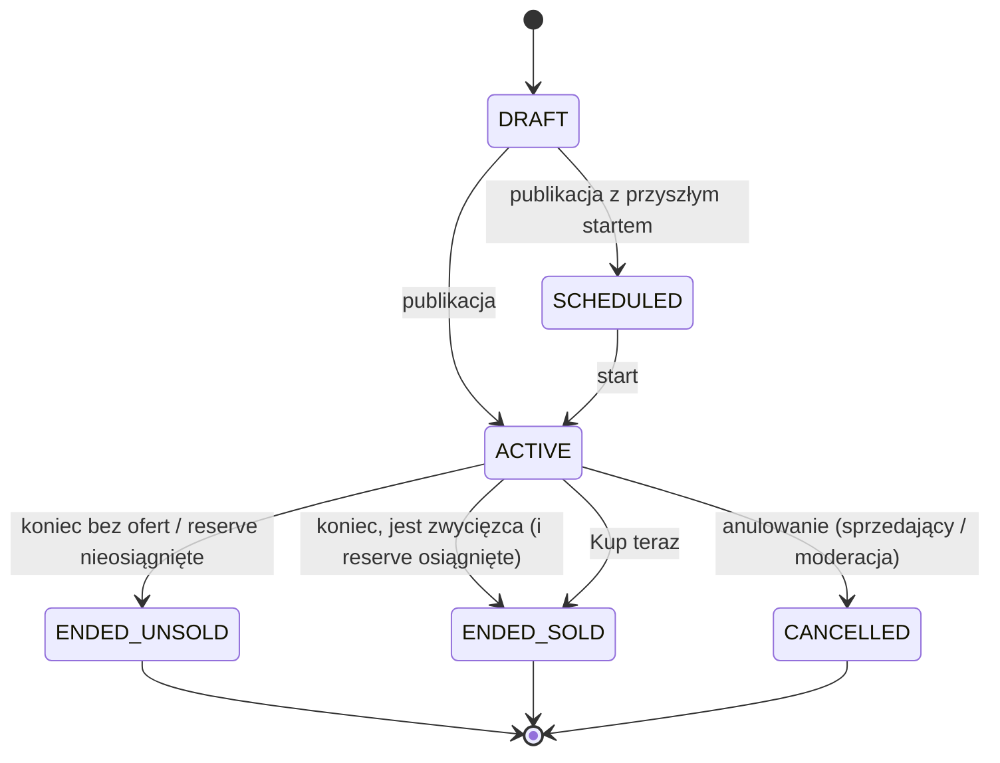
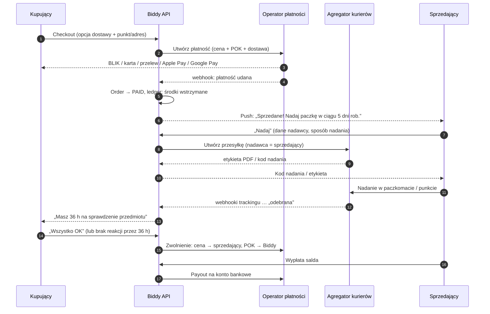
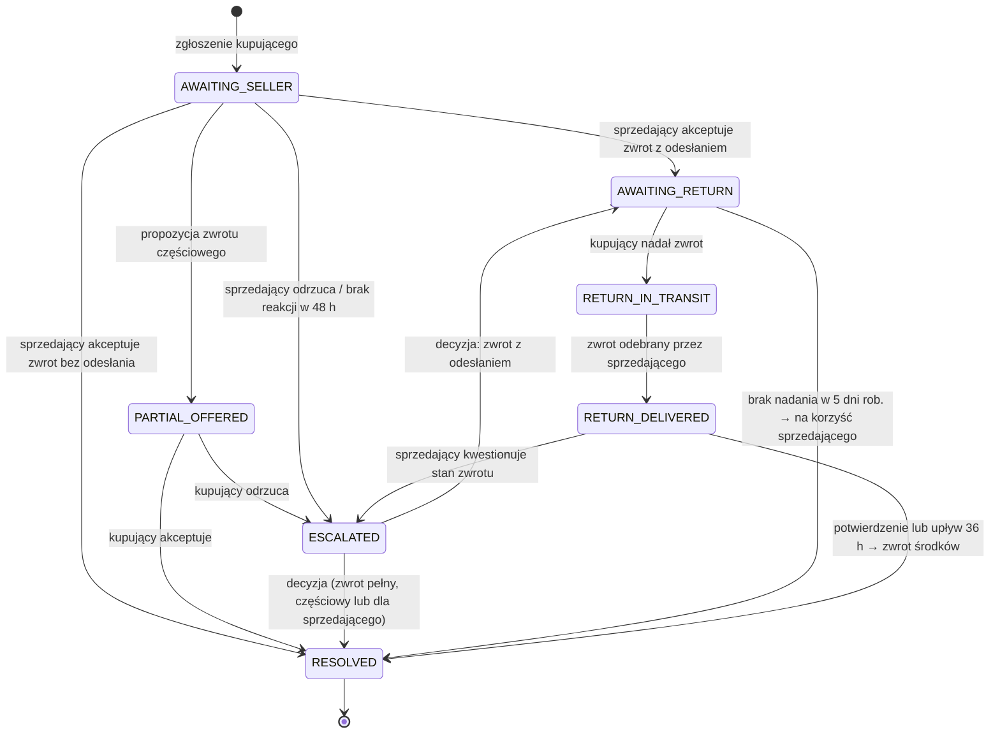
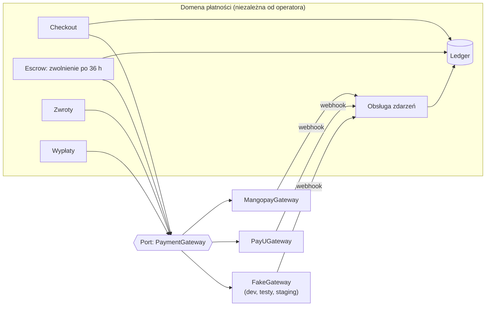
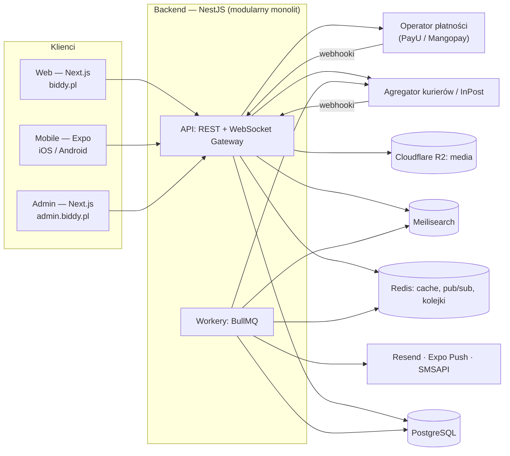
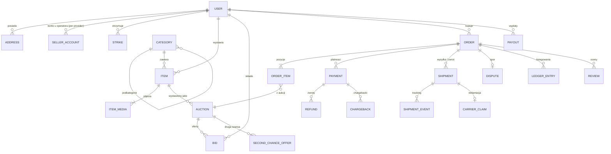

# Biddy — specyfikacja projektu

> **Wersja:** 0.4 · **Data:** 2026-10-08 · **Status:** gotowy do startu implementacji
>
> Dokument opisuje produkt, model biznesowy, zasady działania licytacji i Pakietu Ochrony Kupujących, architekturę, stack technologiczny, model danych oraz plan wdrożenia.
>
> **Oznaczenia decyzji:**
> - **[DECYZJA]** — przyjęta, obowiązuje w implementacji.
> - **[DECYZJA TYMCZASOWA]** — przyjęta na start, ale zależy od danych zewnętrznych (oferta operatora, opinia prawnika lub księgowego). Implementujemy ją **konfigurowalnie**, żeby zmiana nie wymagała przepisywania kodu. Pełny rejestr: [§22](#22-rejestr-decyzji).
>
> **Zmiany w v0.4:**
> - Rozstrzygnięte wszystkie punkty „do ustalenia”: progi POK, minimalna cena wywoławcza, przesyłki nieodebrane, start web-first. Rejestr decyzji zastępuje listę otwartych pytań ([§22](#22-rejestr-decyzji)).
> - Nowe sekcje: limity kont i strike'i ([§4.1](#41-limity-kont-i-strikei)), straty, chargebacki i rekompensaty ([§7.9](#79-straty-chargebacki-i-rekompensaty)), pytania do prawnika i księgowego ([§17.1](#171-pytania-do-prawnika-i-księgowego)).
> - Doprecyzowane: maszyna stanów zamówienia i sporu, plan kont ledgera, anti-sniping, unieważnianie ofert, zamykanie aukcji, model danych i API.
> - Roadmapa przeliczona pod start web-first ([§20](#20-roadmapa)).
>
> **Zmiany w v0.2:**
> - Licytacje na żywo (live streaming) wyłączone z MVP, zostaje tylko notka o przyszłych wersjach ([§9](#9-licytacje-na-żywo--przyszłe-wersje)).
> - Nowe porównanie operatorów płatności z alternatywami dla Stripe Connect ([§7.6](#76-operator-płatności)).
>
> **Zmiany w v0.3:**
> - Architektura modułu płatności jako adapter oraz plan budowy przed wyborem operatora ([§7.8](#78-moduł-płatności-adapter)).
> - Faza 2 roadmapy podzielona na część niezależną od operatora i część po jego wyborze.

---

## Spis treści

1. [TL;DR](#1-tldr)
2. [Wizja produktu i pozycjonowanie](#2-wizja-produktu-i-pozycjonowanie)
3. [Model biznesowy](#3-model-biznesowy)
4. [Role użytkowników](#4-role-użytkowników)
5. [Zakres funkcjonalny i priorytety](#5-zakres-funkcjonalny-i-priorytety)
6. [Mechanika licytacji](#6-mechanika-licytacji)
7. [Transakcja i Pakiet Ochrony Kupujących (POK)](#7-transakcja-i-pakiet-ochrony-kupujących-pok)
8. [Dostawa](#8-dostawa)
9. [Licytacje na żywo — przyszłe wersje](#9-licytacje-na-żywo--przyszłe-wersje)
10. [Architektura systemu](#10-architektura-systemu)
11. [Stack technologiczny i usługi](#11-stack-technologiczny-i-usługi)
12. [Struktura repozytorium](#12-struktura-repozytorium)
13. [Model danych](#13-model-danych)
14. [API i zdarzenia realtime](#14-api-i-zdarzenia-realtime)
15. [Kluczowe algorytmy](#15-kluczowe-algorytmy)
16. [Bezpieczeństwo i przeciwdziałanie nadużyciom](#16-bezpieczeństwo-i-przeciwdziałanie-nadużyciom)
17. [Prawo i compliance](#17-prawo-i-compliance)
18. [Infrastruktura, DevOps, jakość](#18-infrastruktura-devops-jakość)
19. [Wymagania niefunkcjonalne](#19-wymagania-niefunkcjonalne)
20. [Roadmapa](#20-roadmapa)
21. [Ryzyka](#21-ryzyka)
22. [Rejestr decyzji](#22-rejestr-decyzji)
23. [Słownik](#23-słownik)
24. [Źródła](#24-źródła)

---

## 1. TL;DR

**Biddy** to marketplace C2C, na którym przedmioty sprzedaje się w formie **licytacji czasowych**. Kupujący płaci za **Pakiet Ochrony Kupujących (POK)**: stała opłata plus procent od wylicytowanej kwoty. W zamian Biddy:

- obsługuje płatność (BLIK, karta, szybki przelew, Apple Pay, Google Pay),
- **wstrzymuje środki** u licencjonowanego operatora płatności do czasu odbioru i weryfikacji przedmiotu (maks. **36 h od odbioru**),
- daje kilka opcji dostawy z gotowymi etykietami i śledzeniem przesyłek,
- prowadzi spory i zwroty.

Sprzedający dostaje **100% wylicytowanej kwoty**. **Startujemy web-first:** platforma w przeglądarce (RWD + PWA z powiadomieniami web push), a aplikacje iOS/Android wchodzą zaraz po publicznym starcie ([§20](#20-roadmapa)).

**Licytacje na żywo** (streamy) są planowane w przyszłych wersjach i **nie wchodzą do MVP**.

**Stack w skrócie:** monorepo Turborepo + pnpm · **Next.js** (web, SEO) · **Expo / React Native** (mobile) · **NestJS** jako modularny monolit (REST + WebSocket) · **PostgreSQL** + **Redis/BullMQ** · **Meilisearch** · **Cloudflare R2** · operator marketplace payments (rekomendacja: **PayU Marketplace**, alternatywa: **Mangopay**) · agregator kurierów (**Furgonetka**) + docelowo bezpośrednio **InPost**.

---

## 2. Wizja produktu i pozycjonowanie

### 2.1 Problem

- Na Vinted czy OLX cenę ustala sprzedający. Przy przedmiotach o niepewnej wartości (kolekcje, vintage, limitowane edycje, elektronika używana) cena jest źle dobrana: za niska albo zawyżona.
- Licytacje w Polsce kojarzą się z „dawnym Allegro”. Brakuje nowoczesnego, mobilnego doświadczenia licytacji z ochroną kupującego.
- Sprzedawcy prowadzą „licytacje” w komentarzach na grupach FB czy Instagramie bez żadnej ochrony płatności, z ręcznym zbieraniem przelewów i dużym ryzykiem oszustw.

### 2.2 Propozycja wartości

| Dla kogo | Wartość |
|---|---|
| **Kupujący** | Uczciwa cena rynkowa, emocje licytacji, ochrona środków do czasu weryfikacji przedmiotu, wygodne dostawy (paczkomat, kurier), zwrot pieniędzy w razie problemu |
| **Sprzedający** | 0% prowizji, 100% wylicytowanej kwoty trafia do niego, gotowe etykiety, wypłaty na konto, cena odkrywana przez rynek |

### 2.3 Konkurencja (skrót)

| Platforma | Licytacje | Ochrona kupującego | Uwagi |
|---|---|---|---|
| Vinted | ❌ | ✅ (2,90 zł + 5%) | Lider C2C moda, stała cena + negocjacje |
| Allegro | ✅ (format niszowy) | ✅ | Nastawione na sprzedawców B2C, prowizje po stronie sprzedającego |
| OLX | ❌ | ✅ (dla Przesyłki OLX) | Ogłoszenia lokalne |
| Whatnot | ✅ (na żywo) | ✅ | Wzorzec dla przyszłego modułu live, rozwija się w Europie |
| Grupy FB / Instagram | „ręczne” | ❌ | Brak ochrony, ręczne przelewy, oszustwa |

**Pozycjonowanie:** *„Vinted, ale z licytacjami”*, czyli nowoczesne licytacje C2C z ochroną kupującego, płatnościami i wysyłką w jednym miejscu.

### 2.4 Strategia wejścia na rynek

Technicznie wspieramy **wszystkie kategorie**, ale marketplace ma problem „kury i jajka”. **[DECYZJA]** Na start koncentrujemy marketing na 2–3 niszach, w których licytacje mają naturalną przewagę:

1. **Kolekcjonerstwo:** karty TCG (Pokémon, MTG, One Piece), LEGO, figurki, monety.
2. **Sneakersy, streetwear, moda vintage.**
3. **Retro gaming i elektronika używana.**

Pozostałe kategorie (dom, RTV, AGD itd.) są dostępne od dnia 1, ale nie są promowane.

---

## 3. Model biznesowy

### 3.1 Pakiet Ochrony Kupujących (POK)

Płaci go **kupujący** jako doliczenie do wylicytowanej kwoty.

```
POK = opłata_stała + Σ (stawka_progu × część kwoty mieszcząca się w progu)
kwota = suma wylicytowanych kwot w zamówieniu
```

**[DECYZJA] Startowa konfiguracja:**

| Próg (część kwoty) | Stawka |
|---|---:|
| 0 – 1000 zł | 7% |
| powyżej 1000 zł | 4% |
| Opłata stała (raz na zamówienie) | 2,99 zł |

Progi działają **krańcowo**, jak progi podatkowe: 4% dotyczy tylko nadwyżki ponad 1000 zł. Dzięki temu POK rośnie płynnie i nie ma skoku na granicy progu. Przykłady: 100 zł → 9,99 zł; 1000 zł → 72,99 zł; 3000 zł → 152,99 zł (zamiast 212,99 zł przy płaskich 7%); 10 000 zł → 432,99 zł.

Stała opłata naliczana jest **raz na zamówienie**, więc kupujący łączący kilka wygranych od jednego sprzedawcy w jedną paczkę (v1) płaci ją tylko raz, a progi liczą się od sumy zamówienia.

Zasady:

- Kwoty są **brutto** (POK to usługa Biddy objęta VAT, patrz [§17](#17-prawo-i-compliance)).
- Cennik POK jest **konfigurowalny i wersjonowany** (tabela `fee_schedules`). Każde zamówienie zapisuje, według którego cennika je policzono. Docelowo cennik może się różnić per kategoria.
- **Dlaczego progi, a nie cap:** koszt płatności rośnie liniowo z kwotą (ok. 1,5%). Przy capie np. 149 zł każda transakcja powyżej ok. 7,8 tys. zł byłaby stratna, i to w segmencie z największym ryzykiem fraudu i sporów. Progi zmniejszają bodziec do ucieczki poza platformę, a marża zostaje dodatnia przy każdej kwocie.
- **7% to świadomie więcej niż na Vinted (5%).** W POK mieści się wstrzymanie środków do weryfikacji przedmiotu, a przy licytacjach cenę ustala rynek. Weryfikujemy to w becie (porzucone checkouty, payment completion rate). Zmiana stawek to nowy wpis w `fee_schedules`, bez deployu.
- **Transparentność:** przy każdym przycisku licytacji pokazujemy cenę końcową, np. *„Licytujesz 100 zł · zapłacisz 109,99 zł + dostawa od 12,99 zł”*. Wymagają tego przepisy konsumenckie, a do tego budujemy zaufanie (patrz lekcja z decyzji UOKiK wobec Vinted, [§17](#17-prawo-i-compliance)).
- Dostawę kupujący płaci osobno, według cennika Biddy dla wybranego przewoźnika i gabarytu.

### 3.2 Przykładowa ekonomika jednostkowa (ilustracyjna)

Założenia: koszt operatora płatności ok. **1,5% + 1,00 zł** od całej kwoty transakcji (**do weryfikacji w ofertach**), VAT 23% od POK. Pominięte są ewentualne koszty kont i wypłat sprzedających, które mocno zależą od operatora (patrz [§7.6](#76-operator-płatności)), oraz rezerwa na spory i fraud.

| Wylicytowana kwota | POK brutto | POK netto | Dostawa | Kupujący płaci | Koszt płatności | **Marża z POK** |
|---:|---:|---:|---:|---:|---:|---:|
| 20,00 zł | 4,39 zł | 3,57 zł | 12,99 zł | 37,38 zł | 1,56 zł | **2,01 zł** |
| 100,00 zł | 9,99 zł | 8,12 zł | 12,99 zł | 122,98 zł | 2,84 zł | **5,28 zł** |
| 1000,00 zł | 72,99 zł | 59,34 zł | 19,99 zł | 1092,98 zł | 17,39 zł | **41,95 zł** |
| 3000,00 zł | 152,99 zł | 124,38 zł | 19,99 zł | 3172,98 zł | 48,59 zł | **75,79 zł** |

Wnioski:

- **Opłata stała jest kluczowa dla tanich przedmiotów.** Minimalna cena wywoławcza prawie nie wpływa na marżę, bo liczy się cena końcowa, a nie wywoławcza. Przy wylicytowanym 1 zł marża wynosi 1,23 zł, przy 5 zł 1,40 zł. Dlatego zostajemy przy 1 zł ([§6.2](#62-parametry-aukcji)). Jeśli w becie tanie zamówienia okażą się problemem (spory, support), dźwignią jest minimalny POK albo łączenie wygranych (v1).
- Przy marży rzędu 2–5 zł na typowej transakcji **każda opłata per sprzedawca lub per wypłata ma ogromne znaczenie**. Dlatego wybór operatora płatności to jedna z najważniejszych decyzji biznesowych ([§7.6](#76-operator-płatności)).
- Tabela nie uwzględnia strat ponoszonych przez Biddy: chargebacków, rekompensat za zaginione paczki i kosztów zwrotu nieodebranych przesyłek ([§7.9](#79-straty-chargebacki-i-rekompensaty)). Mierzymy je w becie jako % GMV.

### 3.3 Dodatkowe źródła przychodu (po MVP)

| Źródło | Faza | Opis |
|---|---|---|
| Wyróżnienia aukcji | v1 | Promowanie w wynikach i na stronie głównej (płatne przez web, patrz uwaga o App Store w §17) |
| Marża na dostawie | MVP | Niewielka różnica między ceną dla kupującego a stawką wynegocjowaną u agregatora |
| Biddy Pro (subskrypcja) | v2 | Dla aktywnych sprzedawców: masowe wystawianie, statystyki, wyższe limity |
| Ubezpieczenie przesyłki | v2 | Dla drogich przedmiotów |
| Weryfikacja autentyczności | v3 | Płatna usługa dla sneakersów, luksusu i kart TCG (grading) |
| Licytacje na żywo | przyszłe wersje | Patrz [§9](#9-licytacje-na-żywo--przyszłe-wersje) |

### 3.4 Kluczowe KPI

GMV · take rate (przychód / GMV) · **sell-through rate** (% aukcji zakończonych sprzedażą) · średnia liczba ofert na aukcję · **payment completion rate** (% wygranych opłaconych) · czas do nadania · dispute rate · % zamówień z auto-zwolnieniem po 36 h · retencja kupujących i sprzedających (D30) · **koszt płatności jako % GMV** · **straty platformy jako % GMV** (chargebacki, rekompensaty, zwroty nieodebranych) · % przesyłek nieodebranych.

---

## 4. Role użytkowników

Jedno konto może być jednocześnie kupującym i sprzedającym (jak na Vinted). Uprawnienia odblokowujemy stopniowo:

| Poziom | Wymagania | Co może |
|---|---|---|
| Gość | — | Przeglądać, wyszukiwać |
| Zarejestrowany | E-mail lub social login, akceptacja regulaminu, oświadczenie 18+ | Obserwować, pisać wiadomości, zapisywać wyszukiwania |
| Zweryfikowany telefon | Kod SMS (1 numer = 1 konto) | **Licytować**, wystawiać (z limitami dla nowych kont) |
| Sprzedawca z KYC | Weryfikacja tożsamości i konta bankowego u operatora płatności | **Wypłacać środki**, wystawiać drogie przedmioty, wyższe limity |

Role wewnętrzne (panel admina): `support`, `moderator`, `finance`, `admin`, z pełnym audit logiem.

### 4.1 Limity kont i strike'i

**[DECYZJA]** Wartości startowe poniżej są domyślne w konfiguracji, a per użytkownik można je nadpisać (`users.limits`). Zmiana nie wymaga deployu.

**Wartość aukcji** na potrzeby limitów i progu KYC to najwyższa z: cena wywoławcza, cena minimalna, cena Kup teraz. Cena końcowa może przekroczyć limit w toku licytacji. Nie blokujemy tego, bo środki i tak są wstrzymane, a wypłata wymaga KYC.

**Limity kupującego:**

| Poziom | Warunek | Maks. kwota oferty (maksimum proxy) | Aukcje z aktywną ofertą |
|---|---|---:|---:|
| Nowy | 0 opłaconych zamówień | 500 zł | 10 |
| Sprawdzony | ≥ 1 opłacone zamówienie | 3000 zł | 50 |
| Zaufany | ≥ 3 zakończone zamówienia i konto ≥ 30 dni | bez limitu | bez limitu |

**Limity sprzedającego:**

| Poziom | Warunek | Aktywne aukcje | Maks. wartość aukcji |
|---|---|---:|---:|
| Nowy | 0 zakończonych sprzedaży | 5 | 500 zł |
| Sprawdzony | ≥ 3 zakończone sprzedaże, 0 przegranych sporów | 20 | 1000 zł |
| Z KYC | pozytywna weryfikacja u operatora | 50 (100 po 10 sprzedażach) | bez limitu |

**Strike'i:**

| Rola | Za co | Skutek |
|---|---|---|
| Kupujący | Brak płatności w terminie, nieodebrana przesyłka | 3 strike'i w 90 dni → blokada licytowania na 30 dni. Druga blokada w ciągu 12 miesięcy → blokada bezterminowa (z możliwością odwołania). |
| Sprzedający | Brak nadania w terminie, anulowanie aukcji z ofertami, spór przegrany z powodu „niezgodny z opisem” | 3 strike'i w 90 dni → blokada wystawiania nowych aukcji na 30 dni. Druga blokada w ciągu 12 miesięcy → blokada bezterminowa. |
| Sprzedający | Potwierdzona podróbka | Natychmiastowa blokada wystawiania i wypłat do decyzji moderatora |

Zasady:

- Strike wygasa po 90 dniach. Liczymy go z tabeli `strikes` (z datą), a nie z licznika.
- Każdy strike i każda blokada mają uzasadnienie widoczne dla użytkownika i można się od nich odwołać. To wymóg DSA (*statement of reasons*, wewnętrzny system odwołań).
- Support może cofnąć strike, np. gdy przewoźnik zawinił przy nadaniu.
- Zasady strike'ów i limitów muszą być opisane w regulaminie i w centrum pomocy.

---

## 5. Zakres funkcjonalny i priorytety

Legenda: **MVP** = publiczny start (web) · **Mobile** = aplikacje iOS/Android ok. 4–6 tygodni po starcie web · **v1** = ok. 3 mies. po MVP · **v2+** = później.

| Obszar | Funkcja | Faza |
|---|---|---|
| Platforma | Web: RWD, PWA (instalacja na ekranie głównym), web push | MVP |
| | Aplikacje iOS i Android (Expo) | Mobile |
| Konto | Rejestracja e-mail, Google, Apple (Apple wymagane na iOS przy social loginach) | MVP |
| | Weryfikacja telefonu SMS, profil, adresy, oświadczenie 18+ | MVP |
| | 2FA (TOTP), powiadomienia o nowym urządzeniu | v1 |
| Wystawianie | Kreator aukcji: zdjęcia (do 20), kategoria z atrybutami, stan, opis, gabaryt, przewoźnicy | MVP |
| | Parametry: cena wywoławcza, czas trwania, cena minimalna, Kup teraz | MVP |
| | Planowany start, automatyczne ponowne wystawienie | v1 |
| | Asystent AI: zdjęcie → propozycja kategorii, tytułu, opisu, atrybutów | v2 |
| Przeglądanie | Kategorie, wyszukiwarka z filtrami (fasety), sortowanie „kończące się” | MVP |
| | Obserwowane aukcje, obserwowani sprzedawcy | MVP |
| | Zapisane wyszukiwania z alertami, rekomendacje | v1 / v2 |
| Licytacja | Licytacja automatyczna (proxy), anti-sniping, cena minimalna, Kup teraz | MVP |
| | Aktualizacje realtime (WebSocket), powiadomienia o przebiciu | MVP |
| | Publiczne pytania do aukcji (Q&A widoczne dla wszystkich) | v1 |
| Transakcja | Checkout: wybór dostawy, płatność, POK | MVP |
| | Wstrzymanie środków, okno 36 h, auto-zwolnienie | MVP |
| | Spory, zwroty, przesyłki zwrotne | MVP (podstawowe) |
| | Łączenie wygranych od jednego sprzedawcy w jedno zamówienie | v1 |
| | Zapisane metody płatności i opcja „opłacaj automatycznie” | v1 |
| | Odbiór osobisty z POK (kod QR przy przekazaniu) | v2 |
| Sprzedawca | Saldo, wypłaty, historia sprzedaży | MVP |
| | Statystyki, masowe wystawianie | v2 |
| Komunikacja | Czat kupujący ↔ sprzedający (per aukcja/zamówienie) | MVP |
| | Wykrywanie prób kontaktu poza platformą (telefon, e-mail, IBAN) | MVP |
| Reputacja | Oceny obustronne po transakcji (także po sporze zakończonym zwrotem), ujawniane po obu ocenach lub po 7 dniach | MVP |
| Powiadomienia | Web push, e-mail, in-app; SMS tylko dla krytycznych (OTP, wygrana o wysokiej wartości) | MVP |
| | Push natywny w aplikacjach (Expo Push) | Mobile |
| Konto | Limity kont i strike'i z odwołaniami ([§4.1](#41-limity-kont-i-strikei)) | MVP |
| Admin | Użytkownicy, moderacja, zgłoszenia (DSA), zamówienia, spory, wypłaty, cenniki, kategorie | MVP (v1 rozszerzenia) |
| Compliance | Zbieranie danych DAC7, eksport raportu | MVP (zbieranie) / v1 (raport) |
| Sprzedawcy firmowi (B2C) | Konta firmowe, prawo odstąpienia 14 dni, faktury | v2 |
| **Live** | Licytacje na żywo, streaming, restream na social media | **Przyszłe wersje** ([§9](#9-licytacje-na-żywo--przyszłe-wersje)) |

---

## 6. Mechanika licytacji

### 6.1 Typ aukcji

W MVP jest jeden typ, `TIMED`, czyli klasyczna aukcja czasowa trwająca 1, 3, 5, 7 lub 10 dni. Własna data końca pojawi się w v1.

Kolumna `auctions.type` istnieje od początku, żeby w przyszłości dodać typ `LIVE` bez migracji danych ([§9](#9-licytacje-na-żywo--przyszłe-wersje)).

### 6.2 Parametry aukcji

- **Cena wywoławcza:** **[DECYZJA]** min. 1 zł. Minimalna cena wywoławcza praktycznie nie zmienia marży ([§3.2](#32-przykładowa-ekonomika-jednostkowa-ilustracyjna)), a „licytacja od 1 zł” to mocny argument marketingowy.
- **Cena minimalna (reserve):** opcjonalna, ukryta. Pokazujemy tylko „cena minimalna nieosiągnięta/osiągnięta”.
- **Kup teraz:** opcjonalne, dostępne **do pierwszej oferty**. Musi być ≥ 130% ceny wywoławczej i ≥ ceny minimalnej.
- **Limity wartości** dla nowych sprzedających i próg KYC: [§4.1](#41-limity-kont-i-strikei).
- **Waluta:** PLN. Model danych przechowuje kod waluty, żeby później dodać EUR.

### 6.3 Kroki przebicia

Minimalne przebicie zależy od aktualnej ceny. Tabela żyje w `packages/shared`, więc front i backend liczą to samo, a backend jest autorytatywny.

| Aktualna cena | Minimalne przebicie |
|---|---:|
| 0,00 – 19,99 zł | 0,50 zł |
| 20,00 – 99,99 zł | 1 zł |
| 100,00 – 499,99 zł | 5 zł |
| 500,00 – 999,99 zł | 10 zł |
| 1000,00 – 4999,99 zł | 25 zł |
| ≥ 5000,00 zł | 50 zł |

### 6.4 Licytacja automatyczna (proxy bidding)

Użytkownik podaje **maksymalną kwotę**, a system licytuje za niego minimalnymi krokami (jak na eBay). Maksimum lidera jest **tajne**.

Reguły rozstrzygania, gdy przychodzi nowa oferta z maksimum `M_new`, a lider ma `M_lead`:

1. Oferta jest ważna, jeśli `M_new ≥ min_next_bid` (pierwsza oferta: `≥ start_price`).
2. Jeśli `M_new > M_lead`: liderem zostaje nowy licytujący, a cena wynosi `min(M_new, M_lead + inc(M_lead))`.
3. Jeśli `M_new ≤ M_lead`: lider się nie zmienia, a cena wynosi `min(M_lead, M_new + inc(M_new))`. **Przy remisie wygrywa wcześniejsza oferta.**
4. **Cena minimalna:** jeśli `M_lead ≥ reserve`, a cena jest niższa niż reserve, cena podnosi się do `reserve`.
5. Lider może podnieść swoje maksimum bez podnoszenia ceny. Wyjątek z reguły 4: jeśli nowe maksimum osiąga reserve, a cena jest niższa, cena podnosi się do reserve.
6. **Unieważnienie oferty** (literówka zgłoszona do supportu, shill bidding): stan aukcji przeliczamy od nowa z pozostałych ważnych ofert ([§15.6](#156-unieważnienie-oferty-replay)). To jedyna sytuacja, w której cena może spaść.

Szczegółowy algorytm i transakcja SQL: [§15.1](#151-składanie-oferty).

### 6.5 Anti-sniping (soft close)

- Oferta złożona w **ostatnich 2 minutach** przesuwa koniec na `teraz + 2 min`. Bez limitu przedłużeń, wartość konfigurowalna.
- **[DECYZJA]** Przedłużenie następuje tylko wtedy, gdy oferta **zmieniła cenę lub lidera**. Lider, który w końcówce podnosi tylko swoje maksimum, nie przedłuża aukcji, bo dla innych nic się nie zmieniło.
- Czas jest **zawsze serwerowy** (`now()` z bazy danych). Klienci synchronizują offset zegara (patrz [§15.4](#154-synchronizacja-czasu)).

### 6.6 Wiążący charakter ofert

- Oferty są **wiążące**. Wycofanie oferty możliwe jest tylko przez support w wyjątkowych przypadkach (np. oczywista literówka zgłoszona w ciągu 5 minut i co najmniej 12 h przed końcem). Po wycofaniu stan aukcji jest przeliczany ([§15.6](#156-unieważnienie-oferty-replay)).
- Sprzedający **nie może anulować** aukcji z ofertami w ostatnich 12 h. Wcześniej może, ale dostaje strike ([§4.1](#41-limity-kont-i-strikei)). Licytujący dostają powiadomienie o anulowaniu.
- Sprzedający i konta z nim powiązane nie mogą licytować jego aukcji (patrz shill bidding, [§16](#16-bezpieczeństwo-i-przeciwdziałanie-nadużyciom)).

### 6.7 Zakończenie aukcji



Po `ENDED_SOLD` w tej samej transakcji tworzymy **zamówienie** w statusie `AWAITING_PAYMENT`.

### 6.8 Brak płatności zwycięzcy

- **[DECYZJA]** Zwycięzca ma **24 h** na checkout. Przypomnienia wysyłamy po 1 h, 12 h i 20 h.
- Płatność rozpoczęta przed terminem i będąca jeszcze w `PENDING` (np. BLIK czeka na potwierdzenie w banku) przesuwa anulowanie o maks. 30 minut.
- Jeśli webhook o udanej płatności przyjdzie dla zamówienia już anulowanego, system automatycznie robi pełny zwrot i nie nalicza strike'a.
- W v1 zwycięzca z zapisaną metodą płatności i domyślną dostawą może włączyć „opłacaj automatycznie”.
- Brak płatności → zamówienie `CANCELLED_UNPAID`, kupujący dostaje **strike** ([§4.1](#41-limity-kont-i-strikei)).
- Sprzedający może wtedy:
  - wysłać **ofertę drugiej szansy** do kolejnego licytującego,
  - albo jednym kliknięciem wystawić przedmiot ponownie (kopia aukcji).

**Oferta drugiej szansy** **[DECYZJA]:**

- Cena to maksimum zadeklarowane przez tego licytującego (jak na eBay). Sprzedający może ją wysłać także wtedy, gdy maksimum jest niższe od ceny minimalnej, bo to jego decyzja.
- Oferta jest ważna 24 h i **nie jest wiążąca** dla licytującego. Odrzucenie lub brak reakcji nie ma konsekwencji.
- Akceptacja tworzy nowe zamówienie `AWAITING_PAYMENT` z terminem płatności 24 h i POK liczonym od ceny oferty.
- Na aukcję przypada najwyżej jedno **aktywne** zamówienie. Wcześniejsze, anulowane zamówienia zostają w historii.

---

## 7. Transakcja i Pakiet Ochrony Kupujących (POK)

### 7.1 Zasada nadrzędna

**[DECYZJA] Biddy nigdy nie przyjmuje środków kupujących na własny rachunek bankowy.** Przechowywanie cudzych pieniędzy to usługa płatnicza wymagająca zezwolenia KNF. Escrow realizujemy u **licencjonowanego operatora marketplace payments**. Operator przechowuje środki, robi KYC sprzedających i wykonuje wypłaty. Biddy steruje tylko przepływem (kiedy zwolnić, komu zwrócić).

### 7.2 Przebieg „szczęśliwej ścieżki”



### 7.3 Maszyna stanów zamówienia

```mermaid
stateDiagram-v2
  [*] --> AWAITING_PAYMENT: aukcja wygrana
  AWAITING_PAYMENT --> PAID: płatność potwierdzona
  AWAITING_PAYMENT --> CANCELLED_UNPAID: brak płatności w terminie
  PAID --> SHIPPED: przesyłka nadana
  PAID --> CANCELLED_NOT_SHIPPED: brak nadania w terminie
  SHIPPED --> DELIVERED: przesyłka odebrana / doręczona
  SHIPPED --> NOT_PICKED_UP: nieodebrana w terminie, wraca do nadawcy
  SHIPPED --> LOST: 14 dni bez statusu końcowego + zgłoszenie kupującego
  DELIVERED --> COMPLETED: potwierdzenie lub upływ 36 h
  DELIVERED --> DISPUTED: zgłoszenie problemu w oknie 36 h
  DISPUTED --> COMPLETED: rozstrzygnięcie dla sprzedającego
  DISPUTED --> REFUNDED: pełny zwrot
  DISPUTED --> PARTIALLY_REFUNDED: zwrot częściowy
  CANCELLED_NOT_SHIPPED --> REFUNDED: pełny zwrot
  LOST --> REFUNDED: pełny zwrot, rekompensata dla sprzedającego (§7.9)
  NOT_PICKED_UP --> REFUNDED: paczka wróciła do nadawcy; zwrot bez kosztu dostawy
  NOT_PICKED_UP --> LOST: zwrot do nadawcy zaginął
  COMPLETED --> [*]
  REFUNDED --> [*]
  PARTIALLY_REFUNDED --> [*]
  CANCELLED_UNPAID --> [*]
```



Zasady maszyny stanów:

- Przejścia są dozwolone tylko według diagramu. Każde przejście to jedna transakcja: zmiana statusu, wpisy w ledgerze i event w outboxie.
- `REFUNDED` oznacza zamówienie zakończone bez sprzedaży. Kwota zwrotu zależy od przyczyny (§7.4, §7.9), a szczegóły są w tabeli `refunds`.
- **Chargeback** nie jest stanem zamówienia, tylko flagą (`orders.chargeback_status`). Przed zwolnieniem środków blokuje auto-zakończenie do rozstrzygnięcia ([§7.9](#79-straty-chargebacki-i-rekompensaty)).

### 7.4 Terminy

Wszystkie terminy są konfigurowalne, a zadania pilnujące terminów działają w kolejce (BullMQ).

| Etap | Termin | Co się dzieje po upływie |
|---|---|---|
| Płatność | 24 h od końca aukcji (+ maks. 30 min, jeśli płatność jest w `PENDING`) | Anulowanie, strike dla kupującego, druga szansa |
| Nadanie | 5 dni roboczych od opłacenia | Anulowanie, pełny zwrot, strike dla sprzedającego |
| Doręczenie | 14 dni od nadania bez statusu końcowego | Kupujący może zgłosić „nie otrzymałem”. Biddy składa reklamację u przewoźnika, zamówienie → `LOST` |
| **Weryfikacja przedmiotu** | **36 h od odbioru** | Auto-zakończenie, zwolnienie środków |
| Odpowiedź sprzedającego w sporze | 48 h | Eskalacja do supportu Biddy |
| Decyzja supportu | 72 h od eskalacji (SLA) | — |
| Nadanie zwrotu przez kupującego | 5 dni roboczych | Spór zamknięty na korzyść sprzedającego |
| Weryfikacja zwrotu przez sprzedającego | 36 h od odbioru zwrotu | Auto-zwrot środków kupującemu |
| Powrót nieodebranej przesyłki | 14 dni od `NOT_PICKED_UP` bez statusu `RETURNED` | Zadanie dla supportu: reklamacja u przewoźnika, ewentualnie `LOST` |

Dni robocze liczymy z kalendarzem polskich świąt ([§15.7](#157-dni-robocze)).

**Odbiór przesyłki** **[DECYZJA]:**

- Okno 36 h liczymy dla paczkomatów i punktów od statusu „odebrana przez odbiorcę”, a dla kuriera od statusu „doręczona”.
- Jeśli przewoźnik zgłosi powrót do nadawcy po upływie terminu odbioru, zamówienie przechodzi w `NOT_PICKED_UP`.
- Jeśli przez 14 dni od nadania nie ma statusu końcowego, kupujący może zgłosić brak przesyłki i uruchamiamy ścieżkę `LOST`.
- Opóźniony webhook przewoźnika przesuwa start okna na korzyść kupującego. To akceptujemy (polling co 2 h ogranicza opóźnienie).

**Przesyłki nieodebrane** **[DECYZJA TYMCZASOWA]** (dopuszczalność potrącenia do potwierdzenia z prawnikiem, [§17.1](#171-pytania-do-prawnika-i-księgowego)):

1. Zamówienie przechodzi w `NOT_PICKED_UP`, a środki pozostają wstrzymane.
2. Zwrot robimy dopiero, gdy paczka **wróci do sprzedającego** (status `RETURNED`), żeby sprzedający nie został bez przedmiotu i bez pieniędzy.
3. Kupujący dostaje zwrot ceny i POK, **bez kosztu dostawy**, oraz strike. Przykład: przy 100 zł kupujący zapłacił 122,98 zł, a dostaje 109,99 zł.
4. Jeśli przewoźnik nalicza opłatę za zwrot do nadawcy, w MVP pokrywa ją Biddy (`platform_losses`). Skalę mierzymy w becie, a potem ewentualnie zmieniamy regulamin.
5. Zasada jest opisana w regulaminie i pokazana przy checkoutcie.

### 7.5 Spory

Powody: *niezgodny z opisem*, *uszkodzony*, *niekompletny*, *podróbka*, *nie otrzymałem*, *inny*.

**Kiedy można zgłosić problem:**

- Spór otwieramy tylko w oknie 36 h od odbioru (zamówienie `DELIVERED`).
- Powód *nie otrzymałem* w sporze dotyczy sytuacji, gdy tracking pokazuje doręczenie, a kupujący przesyłki nie dostał.
- Brak statusu końcowego przez 14 dni to nie spór ze sprzedającym, tylko ścieżka `LOST` (§7.4). Obsługuje ją Biddy z przewoźnikiem.

Przebieg:

1. Kupujący zgłasza problem: powód, opis, zdjęcia lub wideo. Środki pozostają zamrożone.
2. Sprzedający ma 48 h na reakcję:
   - akceptuje zwrot (z odesłaniem lub bez),
   - proponuje zwrot częściowy,
   - odrzuca.
3. Brak porozumienia oznacza eskalację do Biddy. Moderator widzi zdjęcia z aukcji, zdjęcia ze sporu, czat i tracking.
4. Przy zwrocie z odesłaniem Biddy generuje etykietę zwrotną. Kupujący nie może zwrócić przedmiotu tylko dlatego, że zmienił zdanie (C2C).
5. Moderator może zdecydować, że winny jest przewoźnik (*uszkodzony*, z dokumentacją zniszczonego opakowania). Wtedy kupujący dostaje pełny zwrot, a sprzedający rekompensatę jak przy zaginięciu ([§7.9](#79-straty-chargebacki-i-rekompensaty)).

**Kwoty zwrotu** **[DECYZJA]:**

| Rozstrzygnięcie | Kupujący dostaje | Sprzedający |
|---|---|---|
| Wina sprzedającego (niezgodny z opisem, niekompletny, podróbka) | Pełny zwrot: cena + POK + dostawa | Nie dostaje ceny. Pokrywa koszt dostawy w obie strony (potrącenie, [§7.9](#79-straty-chargebacki-i-rekompensaty)) + strike |
| Zwrot częściowy (porozumienie lub decyzja) | Ustalona kwota, **tylko z części sprzedającego** (maks. cena) | Dostaje cenę pomniejszoną o zwrot. POK i dostawa nie są zwracane |
| Wina przewoźnika | Pełny zwrot | Rekompensata (§7.9) |
| Na korzyść sprzedającego | — | Zwolnienie środków jak przy `COMPLETED` |

Wszystkie decyzje zapisujemy z uzasadnieniem (wymóg DSA, *statement of reasons*). Po rozstrzygnięciu obie strony mogą wystawić ocenę.

**Stany sporu** (`disputes.status`):



Zamówienie pozostaje w `DISPUTED` aż spór przejdzie w `RESOLVED`. Wtedy zamówienie przechodzi w `COMPLETED`, `REFUNDED` lub `PARTIALLY_REFUNDED`.

### 7.6 Operator płatności

#### Problem z kosztami Stripe Connect

Stripe Connect w Polsce przy modelu, w którym platforma ustala ceny, kosztuje **9 zł za każde konto sprzedawcy aktywne w danym miesiącu** oraz **0,25% + 1,35 zł za każdą wypłatę**.

Przykład: sprzedawca sprzedaje jeden przedmiot za 50 zł w miesiącu i wypłaca środki. Koszt Connect to ok. **10,50 zł**, a marża z POK przy tej transakcji to ok. 3–4 zł. **Każdy okazjonalny sprzedawca generuje stratę.** W modelu C2C, gdzie większość sprzedawców sprzedaje rzadko i tanio, to dyskwalifikuje Stripe Connect jako główny wybór.

#### Alternatywy

| Operator | Struktura kosztów (z publicznych źródeł) | Sprzedawcy prywatni (C2C) | Wstrzymanie środków | BLIK | Ocena |
|---|---|---|---|---|---|
| **PayU Marketplace** | Cennik indywidualny. Brak publicznie znanej opłaty miesięcznej per sprzedawca (**potwierdzić w ofercie**). | ✅ Rejestracja sprzedawców przez API, także osób prywatnych. KYC/AML robi PayU. Sprawdzone w polskim C2C (operator płatności Przesyłki OLX). | ✅ Środki na saldzie sprzedawcy w PayU, wypłaty zlecane przez Payouts API (**potwierdzić**, że da się wyłączyć automatyczne wypłaty) | ✅ natywnie, także BLIK wpisywany bezpośrednio w UI Biddy | **Rekomendacja nr 1.** Lokalny lider, polskie wsparcie, publiczny sandbox. API mniej eleganckie niż Stripe. |
| **Mangopay** | Cennik indywidualny. Ze starszych publicznych cenników: wpłata ok. 1,4% + 0,25 €, wypłata od 0,20 €, transfery między portfelami bezpłatne, **opłata platformowa od ok. 249 €/mies.** | ✅ Projektowany pod C2C | ✅ Najbardziej elastyczne (portfel per użytkownik = naturalny escrow) | ✅ | **Rekomendacja nr 2.** Brak opłaty per sprzedawca, ale stała opłata miesięczna. Opłaca się od pewnej skali. |
| **Tpay Marketplace** | Cennik indywidualny | ❓ Dokumentacja nie precyzuje, czy sprzedawcy mogą być osobami prywatnymi | ❓ Do potwierdzenia | ✅ | Zapytać w ofercie |
| **Przelewy24 Marketplace** | Cennik indywidualny, konfigurowalny podział prowizji | ❓ Do potwierdzenia | ❓ Do potwierdzenia | ✅ | Zapytać w ofercie |
| **Mollie Connect for Marketplaces** | 5 € jednorazowo per sprzedawca, **1,75 €/mies. per aktywny sprzedawca**, 0,2% routingu. BLIK 1,60% + 0,25 €. | ⚠️ Onboarding oparty na weryfikacji firm (KYB). Osoby prywatne niepotwierdzone. | ✅ Opóźniony routing | ✅ | Tańszy od Stripe, ale prawdopodobnie nie dla C2C |
| **Lemonway** | Cennik indywidualny | ✅ C2C, second-hand | ✅ Escrow | ❓ PLN obsługiwany, BLIK niepotwierdzony | Francuska instytucja płatnicza, opcja zapasowa |
| **Adyen for Platforms** | Ok. 0,11 € za transakcję + opłata metody (BLIK ok. 1,5%). **Minimalna faktura miesięczna** (kwota niepublikowana, zależna od branży), opłaty za KYC per sprzedawca i za każdą wypłatę. | ✅ | ✅ | ✅ | Używany przez Vinted. Brak samoobsługi, proces sprzedażowy, wdrożenie w tygodniach lub miesiącach, nastawiony na duży wolumen. Wrócić przy dużej skali lub ekspansji zagranicznej. |
| Stripe Connect (punkt odniesienia) | 9 zł/aktywne konto/mies. + 0,25% + 1,35 zł za wypłatę | ✅ | ✅ | ✅ | Najlepsze API, ale koszty per sprzedawca zabijają ekonomikę C2C. Tylko plan awaryjny. |

**Próg opłacalności Mangopay vs Stripe:** 249 € to ok. 1060 zł miesięcznie, czyli tyle, ile Stripe pobrałby za ok. **120 aktywnych sprzedawców** (bez opłat za wypłaty). Powyżej tej skali Mangopay jest tańszy. Poniżej trzeba porównać pełne oferty.

#### Rekomendacja

1. **Faza 0:** zapytania ofertowe do **PayU**, **Mangopay**, **Tpay** i **Przelewy24**. Stripe służy tylko jako punkt odniesienia. Pytaj konkretnie o:
   - koszt transakcji BLIK, kart i przelewów,
   - opłaty per sprzedawca (jednorazowe i miesięczne),
   - koszt wypłaty,
   - obsługę **osób prywatnych** jako sprzedawców,
   - możliwość **wstrzymania wypłat** do decyzji platformy i maksymalny czas wstrzymania. **Wymagamy co najmniej 60 dni**, bo najdłuższa ścieżka (nadanie, doręczenie, spór, odesłanie zwrotu) trwa ok. 50 dni,
   - przebieg KYC (jakie dokumenty, ile trwa),
   - **czy płatność ze splitem na sprzedawcę działa, zanim sprzedawca skończy KYC**, i co jest minimum do jego rejestracji (patrz niżej),
   - refundy, także po wypłacie środków przez sprzedawcę, oraz chargebacki: kto odpowiada, terminy, jak przekazujemy dowody,
   - **przenoszenie środków** między saldem platformy a saldem sprzedawcy (potrącenia, rekompensaty, [§7.9](#79-straty-chargebacki-i-rekompensaty)),
   - minimalne opłaty miesięczne,
   - wymogi umowne dla startupu.
2. **[DECYZJA] Domyślny wybór: PayU Marketplace**, jeśli oferta potwierdzi brak opłat per sprzedawca i kontrolę nad wypłatami. Development można zacząć na publicznym sandboksie PayU. **Plan B: Mangopay.**
3. Moduł płatności budujemy za interfejsem `PaymentGateway` (adapter). Reszta systemu nie zna operatora, więc zmiana w przyszłości to nowy adapter, a nie przepisywanie domeny. Większość modułu powstaje jeszcze przed wyborem operatora, patrz [§7.8](#78-moduł-płatności-adapter).
4. **[DECYZJA] Niezależnie od operatora ograniczamy liczbę wypłat:**
   - saldo sprzedającego w Biddy, wypłata na żądanie z minimalną kwotą **20 zł**,
   - opcjonalnie automatyczna wypłata zbiorcza raz w tygodniu (sprzedający włącza ją w ustawieniach, obowiązuje to samo minimum),
   - saldo poniżej minimum **nie może utknąć**: wypłacamy całość przy zamknięciu konta i automatycznie po 90 dniach bez nowych sprzedaży (lekcja z Vinted, [§17](#17-prawo-i-compliance)).
5. **[DECYZJA TYMCZASOWA] Moment rejestracji sprzedawcy u operatora.**
   - Domyślnie: rejestracja z minimalnym zestawem danych przy **pierwszym wystawieniu** (asynchronicznie, bez blokowania kreatora), a pełne KYC przed pierwszą wypłatą lub przed aukcją o wartości > 1000 zł.
   - Jeśli operator przyjmie płatność na rzecz sprzedawcy dopiero po pełnym KYC, przenosimy KYC przed pierwszą publikację. To gorszy UX, więc w takim przypadku Mangopay (portfel kupującego nie wymaga konta sprzedawcy do zwolnienia środków) zyskuje w porównaniu.

> **Opcja długoterminowa:** własne zezwolenie, np. wpis jako **mała instytucja płatnicza (MIP)** w KNF, pozwoliłoby obsługiwać escrow bez pośrednika. Wymaga to procedur AML, kapitału, raportowania i ma limity obrotu. To temat na etap dużej skali, do analizy z prawnikiem, **nie na MVP**.

Mapowanie modelu na operatorów (do potwierdzenia w dokumentacji i umowie):

| Krok | PayU Marketplace | Mangopay |
|---|---|---|
| Wpłata kupującego | Zamówienie z koszykiem (`shoppingCarts`): część dla sprzedawcy, część (POK + dostawa) dla Biddy | PayIn do portfela kupującego |
| Wstrzymanie | Środki na saldzie sprzedawcy w PayU, bez automatycznej wypłaty | Środki w portfelu kupującego |
| Zwolnienie | Biddy oznacza zamówienie jako zakończone w ledgerze, środki stają się dostępne do wypłaty | Transfer portfel kupującego → portfel sprzedającego, POK jako opłata do portfela platformy |
| Zwrot | Refund zamówienia (z salda sprzedawcy, zanim środki zostaną wypłacone) | Refund PayIn |
| Wypłata | Payouts API z salda sprzedawcy | PayOut z portfela sprzedającego |
| Przeniesienie środków (potrącenia, rekompensaty) | Do potwierdzenia (np. korekta splitu przy kolejnej płatności na rzecz sprzedawcy) | Transfer między portfelami |

### 7.7 Księga (ledger)

**[DECYZJA]** Niezależnie od operatora prowadzimy **wewnętrzną księgę podwójnego zapisu** (`ledger_entries`, niemodyfikowalne wpisy). Każdy ruch pieniądza ma dwie strony. Codzienny job **uzgadnia** księgę z raportami operatora. Ledger jest też źródłem prawdy dla pytania „czy te środki wolno już wypłacić?”, zwłaszcza u operatorów, gdzie środki od razu lądują na saldzie sprzedawcy.

**Zakres:** ledger rejestruje pieniądze klientów u operatora oraz zobowiązania i należności Biddy wobec użytkowników. **Nie jest** pełną księgowością spółki: faktury kosztowe przewoźników, rachunek firmowy i podatki prowadzi biuro księgowe. Eksport z ledgera jest dla księgowości źródłem danych.

**Konwencja:** każdy wpis ma kwotę ze znakiem (`+` = Winien / debet, `−` = Ma / kredyt). Suma wpisów jednej transakcji (`transaction_id`) wynosi zawsze 0.

**Plan kont** **[DECYZJA]:**

| Konto | Typ | Znaczenie |
|---|---|---|
| `provider_cash:{provider}` | aktywa | Środki u operatora płatności (wpłaty minus zwroty, wypłaty i opłaty) |
| `seller_receivable:{userId}` | aktywa | Należność od sprzedającego (np. koszt dostawy po przegranym sporze, gdy saldo było za małe) |
| `carrier_claims_receivable` | aktywa | Należności od przewoźników z reklamacji |
| `buyer_funds_held:{orderId}` | zobowiązanie | Cała wpłata kupującego na zamówienie, wstrzymana do zakończenia |
| `seller_balance_available:{userId}` | zobowiązanie | Saldo sprzedającego do wypłaty |
| `payouts_in_transit:{payoutId}` | zobowiązanie | Wypłata zlecona, czeka na potwierdzenie operatora |
| `vat_payable` | zobowiązanie | VAT należny od POK |
| `platform_revenue_pok` | przychód | POK netto |
| `platform_shipping` | przychód | Opłaty za dostawę pobrane od kupujących i odzyskane od sprzedających |
| `payment_fees_expense` | koszt | Opłaty operatora |
| `platform_losses` | koszt | Straty: chargebacki, rekompensaty, zwroty nieodebranych, spisane należności |
| `platform_external` | rozliczeniowe | Przepływy poza operatorem, np. rekompensata wypłacona przelewem z rachunku firmowego |

„Saldo w trakcie” sprzedającego to **nie** osobne konto. Liczymy je z `buyer_funds_held` jego otwartych zamówień (część `items_total`). Dzięki temu te same pieniądze nie są księgowane dwa razy.

**Wzorcowe księgowania** (D = debet, C = kredyt; cena = `items_total`):

| Zdarzenie | Księgowanie |
|---|---|
| Płatność udana | D `provider_cash` total · C `buyer_funds_held` total |
| Zakończenie (`COMPLETED`) | D `buyer_funds_held` total · C `seller_balance_available` cena (najpierw spłata `seller_receivable`, jeśli jest) · C `platform_revenue_pok` POK netto · C `vat_payable` VAT od POK · C `platform_shipping` dostawa |
| Pełny zwrot | D `buyer_funds_held` total · C `provider_cash` total |
| Zwrot nieodebranej | D `buyer_funds_held` total · C `provider_cash` (total − dostawa) · C `platform_shipping` dostawa |
| Zwrot częściowy | D `buyer_funds_held` kwota zwrotu · C `provider_cash` kwota zwrotu. Reszta jak przy zakończeniu, z ceną pomniejszoną o zwrot |
| Zlecenie wypłaty | D `seller_balance_available` · C `payouts_in_transit` |
| Wypłata zrealizowana / nieudana | D `payouts_in_transit` · C `provider_cash` / storno do `seller_balance_available` |
| Opłata operatora | D `payment_fees_expense` · C `provider_cash` |
| Koszty sporu po stronie sprzedającego | D `seller_balance_available` (do wysokości salda) + D `seller_receivable` (reszta) · C `platform_shipping` |
| Chargeback po zakończeniu, ponosi Biddy | D `platform_losses` · C `provider_cash` |
| Rekompensata za zaginioną paczkę | D `carrier_claims_receivable` · C `seller_balance_available` lub `platform_external`. Nieodzyskana część reklamacji → D `platform_losses` · C `carrier_claims_receivable` |

Niezmienniki (testowane w F-22):

- Suma każdej transakcji = 0.
- `seller_balance_available` nigdy nie jest ujemne. Niedobór trafia na `seller_receivable`.
- `buyer_funds_held:{orderId}` po zakończeniu zamówienia (w każdym stanie końcowym) wynosi 0.
- Każde saldo da się odtworzyć z samych wpisów.

Wszystkie kwoty są w **groszach jako liczby całkowite** (`bigint`). **Nigdy float.** Zaokrąglenia POK i VAT: half-up do grosza, jedna funkcja w `packages/shared`.

### 7.8 Moduł płatności (adapter)

**[DECYZJA] Moduł płatności budujemy, zanim wybierzemy operatora.** Większość pracy nie zależy od operatora: ledger, kalkulacja POK, maszyna stanów zamówienia, wstrzymanie i zwolnienie środków, saldo i wypłaty, obsługa webhooków, checkout w UI. Od operatora zależy tylko cienka warstwa adaptera, którą dopisujemy po decyzji.

#### Zasada: porty i adaptery

Domena Biddy rozmawia z operatorem wyłącznie przez interfejs (port) `PaymentGateway`. Interfejs opisuje **operacje biznesowe Biddy** (utwórz płatność, zwolnij środki, zwróć, wypłać), a nie wywołania API konkretnego operatora.



#### Interfejs (szkic)

```ts
// apps/api/src/modules/payments/ports/payment-gateway.port.ts
import type { Money } from '@biddy/shared'; // { amount: number /* grosze */; currency: 'PLN' }

export type PaymentProvider = 'fake' | 'payu' | 'mangopay' | 'stripe';

export interface PaymentGateway {
  readonly provider: PaymentProvider;
  readonly capabilities: GatewayCapabilities;

  registerSeller(input: RegisterSellerInput): Promise<SellerAccountResult>;
  getSellerStatus(providerSellerId: string): Promise<SellerStatus>;

  createPayment(input: CreatePaymentInput): Promise<CreatePaymentResult>;
  getPayment(providerPaymentId: string): Promise<PaymentSnapshot>;

  releaseFunds(input: ReleaseFundsInput): Promise<ReleaseFundsResult>;
  refund(input: RefundInput): Promise<RefundResult>;
  createPayout(input: CreatePayoutInput): Promise<PayoutResult>;

  /** Weryfikuje podpis i tłumaczy webhook operatora na zdarzenia Biddy. */
  parseWebhook(req: RawWebhookRequest): Promise<NormalizedPaymentEvent[]>;
}

export type GatewayCapabilities = {
  holdModel: 'PLATFORM_BALANCE' | 'BUYER_WALLET' | 'SELLER_BALANCE';
  maxHoldDays: number;
  partialRefunds: boolean;
  blikCodeInOwnUi: boolean;   // kod BLIK wpisywany w UI Biddy
  embeddedKyc: boolean;       // KYC w naszym UI zamiast przekierowania
  savedCards: boolean;
  internalTransfers: boolean; // przeniesienie środków platforma ↔ sprzedawca (potrącenia, rekompensaty)
  paymentRequiresVerifiedSeller: boolean; // split na sprzedawcę wymaga zakończonego KYC
};

export type CreatePaymentInput = {
  orderId: string;
  idempotencyKey: string;
  total: Money;
  split: { providerSellerId: string; sellerAmount: Money; platformAmount: Money };
  method:
    | { type: 'BLIK'; code?: string }
    | { type: 'CARD' }
    | { type: 'PAY_BY_LINK'; bankId?: string }
    | { type: 'APPLE_PAY' | 'GOOGLE_PAY' };
  buyer: { id: string; email: string; ip: string };
  returnUrl: string;
};

export type CreatePaymentResult =
  | { status: 'SUCCEEDED' | 'PENDING'; providerPaymentId: string }
  | { status: 'ACTION_REQUIRED'; providerPaymentId: string; redirectUrl: string }
  | { status: 'FAILED'; providerPaymentId?: string; reason: PaymentFailureReason };

export type NormalizedPaymentEvent = { eventId: string; occurredAt: Date } & (
  | { type: 'PAYMENT_SUCCEEDED'; providerPaymentId: string; amount: Money; providerFee?: Money }
  | { type: 'PAYMENT_FAILED'; providerPaymentId: string; reason: PaymentFailureReason }
  | { type: 'REFUND_SUCCEEDED' | 'REFUND_FAILED'; providerRefundId: string; amount: Money }
  | { type: 'PAYOUT_PAID' | 'PAYOUT_FAILED'; providerPayoutId: string; amount: Money }
  | { type: 'SELLER_STATUS_CHANGED'; providerSellerId: string; status: SellerStatus }
  | { type: 'CHARGEBACK_OPENED' | 'CHARGEBACK_CLOSED'; providerPaymentId: string; amount: Money }
);
```

Nie projektujemy interfejsu w próżni. Zanim go zamrozimy, przechodzimy „na papierze” przez publiczną dokumentację PayU i Mangopay i sprawdzamy, czy każdą operację da się zmapować (tabela w [§7.6](#76-operator-płatności)). Interfejs i tak zmieni się trochę przy pierwszym prawdziwym adapterze, i to jest w porządku.

#### Różne modele wstrzymania środków

Operatorzy różnie przechowują środki w trakcie wstrzymania. Domena pyta adapter o `capabilities.holdModel`, ale logika biznesowa jest ta sama.

| `holdModel` | Przykład | `createPayment` | `releaseFunds` | Wypłata |
|---|---|---|---|---|
| `PLATFORM_BALANCE` | Stripe | Środki na saldzie platformy | Transfer do konta sprzedawcy | Payout z konta sprzedawcy |
| `BUYER_WALLET` | Mangopay | PayIn do portfela kupującego | Transfer do portfela sprzedawcy + opłata platformy | PayOut z portfela sprzedawcy |
| `SELLER_BALANCE` | PayU (do potwierdzenia) | Split: część od razu na saldo sprzedawcy, część na saldo platformy | Brak wywołania u operatora, zwolnienie tylko w ledgerze | Payouts API z salda sprzedawcy |

W modelu `SELLER_BALANCE` jedyną blokadą przed przedwczesną wypłatą jest nasz ledger. Dlatego `PayoutService` **zawsze** sprawdza `seller_balance_available` w ledgerze, a nie saldo u operatora.

#### Przetwarzanie zdarzeń

1. `POST /webhooks/payments/:provider` przyjmuje surowe body.
2. `adapter.parseWebhook()` weryfikuje podpis i zwraca zdarzenia znormalizowane.
3. Tabela `processed_webhooks` zapewnia idempotencję (to samo zdarzenie przetwarzamy raz).
4. Handler domenowy w jednej transakcji aktualizuje płatność, zapisuje wpisy w ledgerze, przełącza stan zamówienia i dodaje eventy do outboxa.
5. Polling zapasowy: job sprawdza przez `getPayment()` płatności w stanie `PENDING` dłużej niż 15 minut, bo webhooki potrafią zaginąć.

#### FakeGateway

Pełnoprawny adapter do developmentu, testów i stagingu. Dzięki niemu cały przepływ transakcji działa end-to-end, zanim podpiszemy umowę z operatorem.

- Symuluje asynchroniczność: po utworzeniu płatności wysyła webhook na nasz własny endpoint `/webhooks/payments/fake` z konfigurowalnym opóźnieniem (job BullMQ), więc testujemy prawdziwą ścieżkę, a nie skrót.
- Magiczne wartości w trybie testowym:
  - kod BLIK `777123` → płatność udana,
  - kod BLIK `111111` → odrzucona,
  - kod BLIK `222222` → wisi w `PENDING` (test pollingu i timeoutów).
- Testowa strona płatności w web (`/dev/fake-pay/:paymentId`) z przyciskami „Zapłać” i „Odrzuć” dla przepływów z przekierowaniem.
- Rejestracja sprzedawcy: domyślnie od razu zweryfikowany, opcjonalnie symulacja weryfikacji w toku lub odrzuconej.
- Panel deweloperski do ręcznego wyzwalania zdarzeń: chargeback, nieudana wypłata, zmiana statusu KYC.
- **Nie może się uruchomić w produkcji.** Walidacja konfiguracji przy starcie aplikacji blokuje `fake` w środowisku `production`.

#### Testy kontraktowe

Jeden wspólny zestaw testów (`describeGatewayContract(makeGateway)` w Vitest), który musi przejść każdy adapter:

- ponowne `createPayment` z tym samym kluczem idempotencji zwraca ten sam wynik,
- `parseWebhook` odrzuca zmanipulowany podpis,
- częściowy zwrot nie może przekroczyć kwoty płatności,
- wypłata ponad dostępne saldo kończy się błędem,
- statusy operatora mapują się na zdarzenia znormalizowane.

Na każdym PR zestaw działa na FakeGateway. Na prawdziwym sandboksie operatora uruchamia się co noc w CI.

#### Zasady

- Typy i SDK operatora wolno importować tylko w `adapters/<operator>/`. Pilnuje tego reguła lint.
- Identyfikatory operatora przechowujemy jako nieprzezroczyste stringi, a surową odpowiedź w kolumnie `raw` (jsonb).
- Każde wywołanie operatora ma nasz klucz idempotencji (np. `orderId:attempt`).
- Kwoty zawsze w groszach.
- Kolumna `provider` w `payments`, `payouts` i `seller_accounts`. Rejestr adapterów (`GatewayRegistry`) wybiera adapter po polu rekordu, więc przy ewentualnej zmianie operatora stare zamówienia dokończą się u starego, a nowe pójdą do nowego. Operator dla nowych płatności pochodzi z konfiguracji `PAYMENTS_DEFAULT_PROVIDER`.

#### Struktura katalogów

```
apps/api/src/modules/payments/
├─ domain/           # Payment, Payout, SellerAccount, reguły i błędy domenowe
├─ application/      # CheckoutService, EscrowService, RefundService, PayoutService,
│                    # PaymentEventHandler, ReconciliationJob
├─ ports/            # payment-gateway.port.ts, zdarzenia, capabilities
├─ adapters/
│  ├─ fake/          # FakeGateway, symulator webhooków, testowa strona płatności
│  ├─ payu/          # po decyzji
│  └─ mangopay/      # po decyzji
├─ webhooks/         # kontroler /webhooks/payments/:provider
└─ contract-tests/   # wspólny zestaw testów dla każdego adaptera
```

Ledger pozostaje osobnym modułem `ledger` ([§10.3](#103-moduły-backendu-bounded-contexts)).

#### Co budujemy teraz, a co po wyborze operatora

| Teraz (niezależne od operatora) | Po wyborze operatora |
|---|---|
| Tabele: `payments`, `refunds`, `chargebacks`, `payouts`, `seller_accounts`, `ledger_entries`, `processed_webhooks`, `fee_schedules` | Adapter: wywołania API, uwierzytelnianie, weryfikacja podpisów webhooków |
| Ledger + testy niezmienników (każda transakcja sumuje się do zera, saldo nigdy ujemne) | Mapowanie statusów i błędów operatora na zdarzenia znormalizowane |
| Kalkulator POK i cenniki | Rejestracja sprzedawcy i KYC: przekierowanie czy osadzenie w naszym UI, wymagane pola |
| Maszyna stanów zamówienia sterowana zdarzeniami | Konkretna realizacja wstrzymania i zwolnienia (`holdModel`) |
| Escrow: zwolnienie po 36 h, spory, zwroty | Realne koszty operatora w ledgerze (`payment_fees_expense`) |
| Saldo sprzedawcy, wypłaty na żądanie, minimalna kwota, blokada 48 h po zmianie konta | Płatności w aplikacji mobilnej (SDK operatora lub jego strona płatności) |
| Pipeline webhooków + polling zapasowy | Import raportów rozliczeniowych do uzgodnień |
| Checkout w web i mobile: wybór metody, kod BLIK, przekierowanie, stany oczekiwania i błędu | Testy kontraktowe na sandboksie operatora, przegląd bezpieczeństwa integracji |
| Formularz danych sprzedawcy do DAC7 (potrzebny niezależnie od operatora) | |
| FakeGateway, testy kontraktowe, e2e całej transakcji | |

**Opcjonalnie:** PayU ma publiczny sandbox, więc adapter PayU (najbardziej prawdopodobny wybór) można zacząć przed podpisaniem umowy. Ryzyko jest małe, bo adapter to cienka warstwa.

### 7.9 Straty, chargebacki i rekompensaty

**[DECYZJA TYMCZASOWA]** Kto ponosi koszt w sytuacjach wyjątkowych. Mechanizm potrąceń zależy od operatora (`capabilities.internalTransfers`), a regulamin musi to opisać (pytania w [§17.1](#171-pytania-do-prawnika-i-księgowego)).

| Sytuacja | Kupujący | Sprzedający | Koszt ponosi |
|---|---|---|---|
| **Zaginięcie przesyłki** (`LOST`) | Pełny zwrot | **Rekompensata = cena**, maks. do limitu odpowiedzialności przewoźnika. Wypłacana po potwierdzeniu zaginięcia przez przewoźnika, nie później niż 30 dni od zgłoszenia | Biddy składa reklamację (jest zleceniodawcą). Odszkodowanie trafia do Biddy, a różnica to `platform_losses` |
| **Uszkodzenie w transporcie** (decyzja moderatora) | Pełny zwrot | Rekompensata jak przy zaginięciu | Jak wyżej |
| **Spór przegrany przez sprzedającego** | Pełny zwrot (cena + POK + dostawa) | Pokrywa dostawę w obie strony: potrącenie z salda, a niedobór jako `seller_receivable` (spłacany z kolejnych sprzedaży, blokada wypłat do spłaty). Strike | Należność nieodzyskana w 180 dni → `platform_losses` |
| **Nieodebrana przesyłka** | Cena + POK, bez dostawy, strike | Odzyskuje przedmiot | Opłata za zwrot do nadawcy (jeśli jest) → Biddy |
| **Chargeback przed zakończeniem** | — | Środki pozostają wstrzymane | Bronimy transakcji dowodami. Przegrany chargeback = pełny zwrot z wstrzymanych środków |
| **Chargeback po zakończeniu**, sprzedający się wywiązał (tracking, brak sporu) | Konto kupującego zablokowane do wyjaśnienia | Nie ponosi kosztu | Biddy (`platform_losses`). Bronimy transakcji dowodami |
| **Chargeback po zakończeniu**, oszustwo sprzedającego wykryte później | — | Należność `seller_receivable`, blokada konta i wypłat | Biddy do czasu odzyskania |

Zasady:

- **Rekompensaty w MVP** wypłacamy na saldo sprzedającego, jeśli operator obsługuje transfery z salda platformy. W przeciwnym razie dział `finance` robi przelew z rachunku firmowego (`platform_external`), z wpisem w panelu admina i audit logu.
- **Dowody do chargebacków** zbieramy automatycznie: tracking z potwierdzeniem odbioru, historia czatu, zdjęcia z aukcji, potwierdzenie „Wszystko OK” lub upływ 36 h.
- **Limit strat:** alert, gdy `platform_losses` w miesiącu przekroczy 0,5% GMV.

---

## 8. Dostawa

### 8.1 Opcje dostawy

**[DECYZJA]**

- **MVP:** integracja przez **agregatora (Furgonetka API)**. Jedna integracja daje wielu przewoźników, mapę punktów, etykiety i tracking.
- **v1:** przy większym wolumenie dochodzi **bezpośrednia umowa i integracja z InPost (ShipX API)**, czyli najpopularniejszą opcją C2C w Polsce, z lepszymi stawkami.

Oba warianty są implementacjami interfejsu `ShippingProvider`.

| Opcja | MVP | Uwagi |
|---|---|---|
| InPost Paczkomat 24/7 | ✅ | Nadanie w paczkomacie z kodem, bez drukowania etykiety |
| InPost Kurier | ✅ | |
| Orlen Paczka | ✅ | |
| DPD Pickup / kurier | ✅ | |
| Poczta Polska (Pocztex) | v1 | |
| Kurier gabarytowy (duże AGD/RTV) | v1 | Wycena po wymiarach i wadze |
| Odbiór osobisty z POK | v2 | Kupujący płaci online, przy odbiorze pokazuje kod QR lub 6 cyfr, sprzedawca skanuje, start okna weryfikacji |

### 8.2 Gabaryty

Sprzedający wybiera gabaryt przy wystawianiu. Gabaryty są zbieżne z paczkomatowymi:

| Gabaryt | Wymiary maks. | Waga maks. |
|---|---|---|
| S | 8 × 38 × 64 cm | 25 kg |
| M | 19 × 38 × 64 cm | 25 kg |
| L | 41 × 38 × 64 cm | 25 kg |
| XL / niestandard | podane wymiary i waga | wg przewoźnika (tylko kurier) |

Sprzedający zaznacza akceptowanych przewoźników. Kupujący widzi ceny dostaw już na stronie aukcji („dostawa od …”).

Limity wymiarów i wagi różnią się między przewoźnikami. Mapowanie „gabaryt → dostępni przewoźnicy i usługi” jest konfiguracją w module `shipping`, a nie stałą w kodzie.

### 8.3 Przepływ

1. Kupujący w checkoutcie wybiera przewoźnika i punkt na mapie (widget przewoźnika lub agregatora) albo adres.
2. Po potwierdzeniu płatności sprzedający dostaje push i e-mail „Sprzedane, nadaj w ciągu 5 dni roboczych”.
3. **[DECYZJA TYMCZASOWA]** Przesyłkę tworzymy, gdy sprzedający kliknie **„Nadaj”**. Uzupełnia wtedy dane nadawcy (imię i nazwisko, telefon, adres, jeśli przewoźnik go wymaga) i wybiera sposób nadania. Dzięki temu nie płacimy za etykiety, które nie zostaną użyte (`CANCELLED_NOT_SHIPPED`). Jeśli Furgonetka nalicza opłatę dopiero przy nadaniu albo bezpłatnie anuluje nieużyte etykiety, możemy tworzyć przesyłkę automatycznie zaraz po płatności.
4. Przesyłkę tworzy worker przez API. Biddy jest zleceniodawcą i płatnikiem, nadawcą jest sprzedający, odbiorcą kupujący. Zapisujemy numer przesyłki, etykietę (PDF w R2) i kod nadania.
5. Tracking działa przez **webhooki** agregatora/przewoźnika oraz **fallback pollingiem** (job co 2 h dla aktywnych przesyłek).
6. Statusy przewoźników mapujemy na wewnętrzne:

```
CREATED → DROPPED_OFF → IN_TRANSIT → OUT_FOR_DELIVERY | READY_FOR_PICKUP → DELIVERED
                                   ↘ EXCEPTION / RETURNING → RETURNED
```

`DELIVERED` (odebrana) uruchamia okno 36 h. `RETURNING` po upływie terminu odbioru przełącza zamówienie w `NOT_PICKED_UP`, a `RETURNED` uruchamia zwrot środków ([§7.4](#74-terminy)).

**Prywatność:** etykieta zawiera dane nadawcy, które zobaczy kupujący. Informujemy o tym sprzedającego przy pierwszym nadaniu i w polityce prywatności.

### 8.4 Reklamacje u przewoźnika

Reklamacje (zaginięcie, uszkodzenie) składa **Biddy** jako zleceniodawca. Panel admina prowadzi je w tabeli `carrier_claims`, a rekompensaty dla sprzedających działają według [§7.9](#79-straty-chargebacki-i-rekompensaty).

### 8.5 Pytania do Furgonetki i InPost (Faza 0)

- Czy płacimy za utworzenie przesyłki, czy za nadanie? Czy nieużytą etykietę można bezpłatnie anulować?
- Czy zwrot nieodebranej przesyłki do nadawcy jest płatny i ile kosztuje?
- Limity odpowiedzialności przewoźników, przebieg i terminy reklamacji, opcje ubezpieczenia.
- Dostępność webhooków trackingu dla każdego przewoźnika, sandbox, limity API.
- Stawki per przewoźnik i gabaryt oraz warunki ich renegocjacji przy wolumenie.

---

## 9. Licytacje na żywo — przyszłe wersje

> 📌 **Poza zakresem MVP.** Licytacje na żywo (sprzedawca prowadzi stream i licytuje kolejne przedmioty, z restreamem na TikTok, Facebook, Instagram i YouTube) planujemy w przyszłych wersjach, po zweryfikowaniu rdzenia produktu. Moduł zaprojektujemy szczegółowo, gdy przyjdzie jego kolej na roadmapie.

Co MVP już dla niego przygotowuje (bez dodatkowej pracy):

- kolumnę `auctions.type`, do której dojdzie wartość `LIVE`,
- infrastrukturę realtime (WebSocket, rooms, synchronizacja czasu serwera),
- modularną architekturę, w której `live` będzie nowym modułem backendu.

---

## 10. Architektura systemu

### 10.1 Decyzje architektoniczne

| # | Decyzja | Uzasadnienie |
|---|---|---|
| ADR-1 | **Modularny monolit** w NestJS zamiast mikroserwisów | Mały zespół, szybkość zmian, transakcje ACID między modułami (aukcja → zamówienie). Granice modułów zgodne z domenami pozwalają wydzielić serwis później. |
| ADR-2 | **PostgreSQL jako jedyne źródło prawdy**, w tym dla licytacji | Pieniądze i oferty wymagają spójności. Warunkowy UPDATE + blokada wiersza wystarcza na setki ofert/s na aukcję. Redis Lua jako sekwencer dopiero, gdy pomiary pokażą potrzebę. |
| ADR-3 | **REST + OpenAPI** dla klientów, **WebSocket (Socket.IO)** dla realtime | Jeden kontrakt dla web i mobile, generowany klient typowany. Socket.IO ma reconnect, rooms i Redis adapter do skalowania poziomego. |
| ADR-4 | **Transactional outbox** dla efektów ubocznych | Powiadomienia, indeksowanie i maile działają at-least-once i nie gubią się przy awarii. Event zapisywany jest w tej samej transakcji co zmiana. |
| ADR-5 | **Next.js dla web** (SSR/ISR), **Expo dla mobile**. Współdzielimy logikę, nie UI. | SEO stron aukcji jest kluczowe dla pozyskania ruchu. Każda platforma dostaje natywne UX. Współdzielone są typy, walidacje (Zod), klient API, kalkulacje opłat i design tokens. |
| ADR-6 | **Licencjonowany operator płatności + własny ledger** | Wymogi prawne (brak zezwolenia KNF), audytowalność, możliwość zmiany operatora |
| ADR-7 | **Adaptery** dla płatności, przewoźników, SMS i maili | Wymienialność dostawców, testy z fake'ami |
| ADR-8 | **EU data residency** (Frankfurt) | RODO, niskie opóźnienia do PL |
| ADR-9 | **Web-first:** publiczny start na web (RWD + PWA + web push), aplikacje Expo zaraz po starcie | Szacunki (FEATURES.md) nie mieszczą web i mobile w planowanym terminie. Web daje SEO i szybsze iteracje w becie. Ryzyko braku natywnych pushy na iOS ograniczamy PWA, e-mailem i krótką Fazą 4. |
| ADR-10 | **ID generowane w aplikacji** (UUIDv7) | Niezależność od wersji Postgresa (natywne `uuidv7()` jest dopiero w PG 18), ID znane przed INSERT (outbox, idempotencja). |

### 10.2 Diagram komponentów



### 10.3 Moduły backendu (bounded contexts)

| Moduł | Odpowiedzialność |
|---|---|
| `identity` | Auth (Better Auth), użytkownicy, weryfikacja telefonu, akceptacje regulaminu, role, limity, strike'i i blokady (§4.1) |
| `catalog` | Kategorie (drzewo), schematy atrybutów, przedmioty |
| `media` | Presigned upload, przetwarzanie zdjęć, usuwanie EXIF, moderacja obrazów |
| `auctions` | Aukcje, oferty, proxy bidding, anti-sniping, zamykanie, obserwowane |
| `orders` | Checkout, maszyna stanów zamówienia, terminy, oferty drugiej szansy |
| `payments` | Adapter operatora, webhooki, KYC status, zwroty, chargebacki, wypłaty |
| `ledger` | Księga podwójnego zapisu, uzgodnienia |
| `shipping` | Adapter przewoźników, wyceny, etykiety, tracking, reklamacje |
| `disputes` | Spory, dowody, decyzje, zwroty |
| `messaging` | Czat kupujący ↔ sprzedający, wykrywanie kontaktu poza platformą, blokowanie użytkowników |
| `reviews` | Oceny i reputacja |
| `notifications` | Web push, push mobilny (Expo, Faza 4), e-mail, SMS, in-app, preferencje |
| `search` | Indeksowanie do Meilisearch, zapisane wyszukiwania |
| `trust-safety` | Zgłoszenia (DSA), reguły antyfraudowe, kolejki moderacji |
| `compliance` | DAC7, eksporty, retencja danych |
| `admin` | API backoffice z RBAC i audit logiem |

Reguła: moduły komunikują się przez **publiczne serwisy modułu** albo **eventy domenowe**, nigdy przez bezpośredni dostęp do cudzych tabel. Pilnuje tego lint (`eslint-plugin-boundaries` lub `dependency-cruiser`).

### 10.4 Procesy uruchomieniowe

Jeden codebase `apps/api` ma dwa entrypointy:

- `main.ts` to **API**: HTTP + WebSocket, bezstanowe, skalowane poziomo. Socket.IO korzysta z Redis adaptera.
- `worker.ts` to **workery BullMQ**: zamykanie aukcji, terminy zamówień, powiadomienia, indeksowanie, tracking, wypłaty, przetwarzanie zdjęć, relay outboxa, rewalidacja stron aukcji w Next.js, joby cykliczne (sweeper aukcji, uzgodnienia ledgera, polling trackingu).

### 10.5 Kanały realtime

| Room | Kto subskrybuje | Zdarzenia |
|---|---|---|
| `auction:{id}` | Oglądający stronę aukcji | `auction.updated`, `auction.extended`, `auction.ended` |
| `user:{id}` | Zalogowany użytkownik (wszystkie urządzenia) | `user.outbid`, `user.won`, `order.updated`, `message.new`, `notification.new` |

Każda wiadomość niesie `serverTime`. Po reconnect klient dociąga stan przez REST (nie polegamy na tym, że WS dostarczy wszystko).

---

## 11. Stack technologiczny i usługi

### 11.1 Wspólne

| Warstwa | Wybór | Uzasadnienie / alternatywa |
|---|---|---|
| Język | **TypeScript** wszędzie | Jeden język, współdzielone typy |
| Runtime | **Node.js 24 LTS** | |
| Monorepo | **Turborepo + pnpm workspaces** | Cache buildów, proste. Alt.: Nx. |
| Walidacja / kontrakty | **Zod** w `packages/shared` | Te same schematy na froncie, w mobile i w NestJS (`nestjs-zod`) |
| Klient API | **OpenAPI** z NestJS, generowany przez **orval** do hooków **TanStack Query** | Typowany klient dla web i mobile bez ręcznego pisania |
| Lint / format | ESLint + Prettier (lub Biome) | |
| Testy | **Vitest**, **Testcontainers** (Postgres/Redis), **Playwright** (web e2e), **Maestro** (mobile e2e), **k6** (load), **fast-check** (property-based dla silnika licytacji) | |

### 11.2 Backend

| Obszar | Wybór | Uzasadnienie / alternatywa |
|---|---|---|
| Framework | **NestJS** (adapter Fastify) | Struktura modułowa, DI, guards, gateway WS |
| Baza | **PostgreSQL 17/18** (najnowsza dostępna na Render) | Transakcje, `FOR UPDATE`, JSONB dla atrybutów, `ltree` dla drzewa kategorii. UUIDv7 generujemy w aplikacji (ADR-10). |
| ORM | **Drizzle ORM** + drizzle-kit (migracje) | Pełna kontrola SQL (blokady, CTE, indeksy częściowe), lekki. Alt.: Prisma (lepszy DX, mniej kontroli). |
| Auth | **Better Auth** (montowany w NestJS, adapter Drizzle) | Open-source, dane u nas. E-mail i hasło, Google, Apple, Facebook, OTP telefonu, 2FA, plugin Expo. Alt.: Clerk (szybciej, ale koszt per MAU i lock-in). |
| Kolejki / joby | **BullMQ** na Redis | Opóźnione joby (koniec aukcji, terminy), retry, repeatable. **Osobna instancja Redis z `maxmemory-policy noeviction`** (wymóg BullMQ: eviction gubi joby). |
| Realtime | **Socket.IO** + `@socket.io/redis-adapter` | Alt.: zarządzany Ably/Pusher przy dużej skali |
| Cache / rate limit / pub-sub | **Redis** (druga instancja, `allkeys-lru`) | Oddzielona od kolejek, żeby zapełniony cache nie blokował jobów |
| Wyszukiwarka | **Meilisearch** (Cloud, EU) | Fasety, tolerancja literówek, proste API. Alt.: Typesense; OpenSearch przy dużej skali. |
| Pliki | **Cloudflare R2** (S3 API) + Cloudflare Image Transformations | Brak opłat za egress, CDN |
| Moderacja obrazów | Sightengine lub AWS Rekognition | NSFW, broń, przemoc |
| E-mail | **Resend** + **React Email** (`packages/emails`) | Alt.: Postmark, AWS SES |
| SMS / OTP | **SMSAPI.pl** | Polski dostawca, tani, dobre doręczalności. Alt.: Twilio. |
| Push | **Expo Push Service** (FCM/APNs pod spodem) | |
| Płatności | **PayU Marketplace** (rekomendacja), **Mangopay** (plan B) | Patrz [§7.6](#76-operator-płatności) |
| Dostawy | **Furgonetka API**, potem **InPost ShipX** | Patrz [§8](#8-dostawa) |

### 11.3 Web (`apps/web`)

| Obszar | Wybór |
|---|---|
| Framework | **Next.js** (App Router, Server Components, ISR dla stron aukcji i kategorii) |
| Świeżość stron aukcji | ISR z `revalidate` 60 s + **rewalidacja na żądanie** (`revalidateTag('auction:{id}')`) wywoływana przez worker po `BidPlaced`, `AuctionExtended` i `AuctionEnded`, maks. raz na 5 s na aukcję. HTML bez JS pokazuje cenę nie starszą niż ok. 10 s. |
| PWA i web push | Manifest, service worker, **Web Push (VAPID)** przez bibliotekę `web-push` w module `notifications`. Na iOS web push działa tylko po dodaniu strony do ekranu głównego (iOS 16.4+), więc po pierwszej ofercie na iPhonie proponujemy instalację. |
| UI | **Tailwind CSS** + **shadcn/ui** (Radix) |
| Dane | TanStack Query (client), fetch w Server Components z przekazywaniem cookie sesji |
| Formularze | react-hook-form + Zod |
| Realtime | `socket.io-client` (wspólny wrapper z `packages/realtime`) |
| i18n | `next-intl` (PL na start, EN później) |
| SEO | Metadata API, `sitemap.xml` (dynamiczny), schema.org `Product` + `Offer`, OG images (`next/og`) |
| Analityka | PostHog (EU), Sentry |

### 11.4 Mobile (`apps/mobile`)

Aplikacje powstają w Fazie 4, zaraz po publicznym starcie web (ADR-9). Wybory poniżej obowiązują bez zmian.

| Obszar | Wybór |
|---|---|
| Framework | **Expo** (aktualne SDK), **Expo Router**, development builds |
| UI | **NativeWind** (Tailwind w RN, wspólne tokeny z web), react-native-reanimated, expo-image |
| Dane / stan | TanStack Query (wygenerowane hooki), Zustand dla stanu lokalnego |
| Auth | Better Auth (plugin Expo), tokeny w `expo-secure-store` |
| Kamera / zdjęcia | expo-camera, expo-image-picker, kompresja przed uploadem |
| Płatności | BLIK: kod wpisywany w natywnym UI Biddy i przekazywany przez API. Karty i pozostałe metody: hostowana strona płatności operatora (in-app browser) lub jego SDK mobilne. |
| Push / deep links | expo-notifications, universal links (`biddy.pl/a/...`) |
| Build / release | **EAS Build**, **EAS Submit**, **EAS Update** (OTA dla JS) |
| Monitoring | Sentry React Native, PostHog |

### 11.5 Panel administracyjny (`apps/admin`)

Osobna aplikacja Next.js z shadcn/ui i TanStack Table, pod osobną domeną (`admin.biddy.pl`). Wymaga 2FA, opcjonalnie allowlisty IP lub Cloudflare Access. RBAC i audit log każdej akcji.

**[DECYZJA]** Admin ma **osobną sesję**: ciasteczko host-only dla `admin.biddy.pl` z innym prefiksem i czasem życia 8 h. Ciasteczko sesji użytkownika (`.biddy.pl`) nie daje dostępu do panelu.

### 11.6 Hosting i usługi zewnętrzne

| Komponent | MVP | Skala (później) |
|---|---|---|
| Web + admin | **Vercel** (region `fra1`) | bez zmian |
| API + workery | **Render** (Frankfurt), kontenery Docker | AWS ECS Fargate (eu-central-1) + Terraform |
| PostgreSQL | Render Postgres (PITR) | AWS RDS / Aurora |
| Redis | Render Key Value, **2 instancje**: kolejki (`noeviction`) oraz cache/pub-sub (`allkeys-lru`) | AWS ElastiCache |
| Wyszukiwarka | Meilisearch Cloud (EU) | bez zmian / self-host |
| Media / CDN | Cloudflare R2 + CDN | bez zmian |
| DNS, WAF, bot protection | **Cloudflare** (w tym Turnstile na rejestracji) | bez zmian |
| Monitoring błędów | **Sentry** (region EU) | |
| Logi, uptime | **Better Stack** lub Grafana Cloud | |
| Analityka, feature flags | **PostHog** (EU Cloud) | |
| Sekrety | Zmienne środowiskowe platform + Doppler lub 1Password | AWS Secrets Manager |
| Mobile CI | EAS | |
| CI | GitHub Actions + Turborepo remote cache | |

Docker od pierwszego dnia, więc migracja z Render do AWS nie wymaga zmian w kodzie. **Szacunek kosztów infrastruktury w MVP** (bez kosztów transakcyjnych): rząd **kilkuset do ok. 2 tys. zł miesięcznie**. Zweryfikuj przy konfiguracji.

---

## 12. Struktura repozytorium

```
biddy/
├─ apps/
│  ├─ web/                 # Next.js — biddy.pl
│  ├─ admin/               # Next.js — admin.biddy.pl
│  ├─ mobile/              # Expo — iOS / Android
│  └─ api/                 # NestJS — main.ts (HTTP+WS), worker.ts (BullMQ)
│     └─ src/
│        ├─ modules/       # identity, catalog, media, auctions, orders,
│        │                 # payments, ledger, shipping, disputes, messaging,
│        │                 # reviews, notifications, search, trust-safety,
│        │                 # compliance, admin
│        ├─ infra/         # db (drizzle), redis, queues, storage, outbox, config
│        ├─ main.ts
│        └─ worker.ts
├─ packages/
│  ├─ shared/              # Zod schemas, typy domenowe, enumy, Money,
│  │                       # tabela przebić, kalkulator POK, stałe
│  ├─ api-client/          # wygenerowany przez orval z OpenAPI + hooki TanStack Query
│  ├─ realtime/            # typy eventów WS + klient Socket.IO (web/mobile)
│  ├─ design-tokens/       # kolory, typografia, spacing → preset Tailwind i NativeWind
│  ├─ emails/              # szablony React Email
│  └─ config/              # eslint, tsconfig, prettier
├─ infra/
│  ├─ docker-compose.yml   # dev: postgres, redis, meilisearch, minio, mailpit
│  └─ terraform/           # (później)
├─ docs/
│  ├─ PROJECT.md           # ten dokument
│  ├─ FEATURES.md          # lista feature speców, szacunki, zależności
│  ├─ features/            # pełne specy F-XX-nazwa.md (just-in-time)
│  └─ adr/                 # Architecture Decision Records
├─ .github/workflows/
├─ turbo.json
└─ pnpm-workspace.yaml
```

**Lokalne środowisko:** `docker compose up` uruchamia Postgres, Redis, Meilisearch, MinIO (zamiast R2) i Mailpit (podgląd maili). Płatności i dostawy działają domyślnie na **FakeGateway** i **FakeShippingProvider**. Sandbox operatora jest opcjonalny, a jego webhooki trafiają do lokalnego API przez tunel (`cloudflared` lub ngrok).

---

## 13. Model danych

### 13.1 Konwencje

- ID: **UUIDv7** (sortowalne czasowo), generowane w aplikacji. W URL-ach krótki publiczny identyfikator i slug: `biddy.pl/a/nike-air-max-90-k3x9qa`.
- Kwoty: `bigint` w groszach + `currency char(3)`.
- Czasy: `timestamptz` w UTC.
- Soft delete tylko tam, gdzie wymaga tego audyt. Dane finansowe są **niemodyfikowalne** (korekty przez nowe wpisy).
- Snapshot przedmiotu w zamówieniu (`order_items.item_snapshot`), bo opis aukcji nie może się zmienić po sprzedaży.

### 13.2 Diagram relacji (główne encje)



### 13.3 Tabele (kluczowe kolumny)

**Tożsamość**

| Tabela | Kolumny |
|---|---|
| `users` | id, email, phone, phone_verified_at, display_name, avatar_key, is_adult_declared_at, status (`ACTIVE`/`LIMITED`/`BANNED`), bidding_blocked_until, listing_blocked_until, limits (jsonb, nadpisania §4.1), created_at |
| `terms_acceptances` | id, user_id, document (`TERMS`/`PRIVACY`), version, accepted_at, ip |
| `strikes` | id, user_id, role (`BUYER`/`SELLER`), reason, order_id, auction_id, issued_by (system/admin), statement_of_reasons, expires_at, appeal_status, revoked_at, created_at |
| `seller_accounts` | id, user_id, provider, provider_account_id, type (`PRIVATE`/`BUSINESS`), kyc_status, payout_method_masked, payouts_blocked_until, dac7_data (szyfrowane), nip, created_at. Unikalne (user_id, provider). |
| `addresses` | id, user_id, name, street, city, postal_code, country, phone, is_default, is_sender_default |
| `payment_methods` (v1) | id, user_id, provider_ref, type, brand, last4, is_default (tylko referencje/tokeny operatora, **żadnych danych kart**) |
| `devices` | id, user_id, platform (`WEB`/`IOS`/`ANDROID`), push_token (Expo), web_push_subscription (jsonb: endpoint, klucze), fingerprint, last_seen_at |
| `user_follows` | follower_id, seller_id, created_at (obserwowani sprzedawcy) |
| `user_blocks` | blocker_id, blocked_id, created_at |
| `notification_preferences` | user_id, type, channel, enabled |

**Katalog i aukcje**

| Tabela | Kolumny |
|---|---|
| `categories` | id, parent_id, path (ltree), slug, name, attribute_schema (jsonb, JSON Schema), is_restricted, is_active |
| `items` | id, seller_id, category_id, title, description, condition (enum), brand, attributes (jsonb), package_size, weight_g, dims, allowed_carriers (text[]), location_city, created_at |
| `item_media` | id, item_id, storage_key, width, height, position, moderation_status |
| `auctions` | id, public_id, item_id, seller_id, type (`TIMED`; w przyszłości `LIVE`), status, start_price, reserve_price, buy_now_price, current_price, leader_id, leader_max_amount (*ukryte*), bid_count, starts_at, ends_at, original_ends_at, extension_policy, version, created_at |
| `bids` | id, auction_id, bidder_id, amount, max_amount, kind (`MANUAL`/`AUTO`/`BUY_NOW`), status (`VALID`/`CANCELLED`), cancel_reason (`TYPO`/`FRAUD`/`REPLAY`), cancelled_by, idempotency_key (unique per bidder), ip, device_id, created_at |
| `watchlist` | user_id, auction_id, created_at |
| `saved_searches` (v1) | id, user_id, query (jsonb), notify, created_at |
| `second_chance_offers` | id, auction_id, bidder_id, amount, status (`PENDING`/`ACCEPTED`/`DECLINED`/`EXPIRED`), expires_at, order_id, created_at |

**Transakcje**

| Tabela | Kolumny |
|---|---|
| `orders` | id, public_id, buyer_id, seller_id, status, items_total, pok_fee, pok_vat, shipping_fee, total, currency, fee_schedule_id, payment_due_at, ship_by, delivered_at, inspection_ends_at, completed_at, cancelled_at, chargeback_status, second_chance_offer_id, created_at |
| `order_items` | id, order_id, auction_id, hammer_price, item_snapshot (jsonb), is_active (false po anulowaniu zamówienia) |
| `fee_schedules` | id, fixed_fee, tiers (jsonb, progi krańcowe, np. `[{"upTo":100000,"bp":700},{"upTo":null,"bp":400}]`; kwoty w groszach, `bp` = punkty bazowe), category_id (nullable), valid_from, valid_to |
| `payments` | id, order_id, provider, provider_payment_id, method, amount, status, failure_reason, idempotency_key, raw (jsonb), created_at |
| `refunds` | id, order_id, payment_id, dispute_id, reason (`DISPUTE`/`NOT_SHIPPED`/`NOT_PICKED_UP`/`LOST`/`LATE_PAYMENT`/`CHARGEBACK`), amount, status, provider_refund_id, idempotency_key, raw (jsonb), created_at |
| `chargebacks` | id, payment_id, order_id, amount, reason, status, liable_party (`PLATFORM`/`SELLER`), provider_ref, evidence_submitted_at, opened_at, closed_at |
| `ledger_entries` | id, transaction_id, account, amount (+/−), currency, order_id, payout_id, description, created_at |
| `payouts` | id, seller_id, provider, amount, status, provider_payout_id, idempotency_key, requested_at, completed_at |
| `shipments` | id, order_id, direction (`OUTBOUND`/`RETURN`), provider, carrier, service, package_size, pickup_point_id, sender (jsonb), recipient (jsonb), tracking_number, label_key, dropoff_code, status, cost, created_at |
| `shipment_events` | id, shipment_id, raw_status, status, occurred_at, raw (jsonb) |
| `carrier_claims` | id, shipment_id, type (`LOST`/`DAMAGED`), status, claimed_amount, recovered_amount, submitted_at, resolved_at |
| `disputes` | id, order_id, opened_by, reason, status (§7.5), resolution, refund_amount, deadline_at, decided_by, decision_reason, created_at |
| `dispute_messages` / `dispute_evidence` | wiadomości i załączniki w sporze |

**Społeczność i operacje**

| Tabela | Kolumny |
|---|---|
| `conversations` / `messages` | czat per aukcja lub zamówienie, flagi wykrytych danych kontaktowych |
| `reviews` | id, order_id, author_id, target_id, role (`BUYER`/`SELLER`), rating, comment, visible_at. Unikalne (order_id, author_id). |
| `notifications` | id, user_id, type, payload, read_at, created_at |
| `reports` | id, reporter_id, target_type, target_id, reason, status, decision, statement_of_reasons, created_at (DSA *notice & action*) |
| `outbox` | id, type, payload, created_at, processed_at, attempts |
| `processed_webhooks` | provider, event_id (PK), processed_at (idempotencja webhooków) |
| `audit_log` | id, actor_id, action, target, diff, ip, created_at |

**Kluczowe indeksy:**

- `auctions(status, ends_at)` dla sweepera i sortowania „kończące się”,
- `bids(auction_id, created_at)`,
- `orders(status, inspection_ends_at)` oraz `orders(status, payment_due_at)` dla jobów terminów,
- unikalny `bids(bidder_id, idempotency_key)`,
- unikalny częściowy `order_items(auction_id) WHERE is_active` (jedno aktywne zamówienie na aukcję; anulowanie zamówienia ustawia `is_active = false` w tej samej transakcji),
- `strikes(user_id, created_at)` dla reguły „3 w 90 dni”,
- `shipments(status)` dla pollingu trackingu, `second_chance_offers(status, expires_at)`.

---

## 14. API i zdarzenia realtime

### 14.1 REST (prefiks `/v1`, OpenAPI pod `/docs`)

```
# Auth (Better Auth, /auth/*)
POST   /auth/sign-up | /auth/sign-in | /auth/sign-in/social | /auth/phone/send-otp | /auth/phone/verify

# Użytkownicy
GET    /me                         PATCH /me
GET    /users/:id                  (profil publiczny, oceny)
CRUD   /me/addresses
POST   /me/terms-acceptances       (akceptacja aktualnej wersji regulaminu / polityki)
POST   /me/seller-onboarding       → rejestracja sprzedawcy i KYC u operatora
GET    /me/balance                 POST /me/payouts             PATCH /me/payout-settings
GET    /me/strikes                 POST /me/strikes/:id/appeal
PUT    /me/followed-sellers/:userId    DELETE /me/followed-sellers/:userId
PUT    /me/blocks/:userId          DELETE /me/blocks/:userId

# Powiadomienia
GET    /me/notifications           POST /me/notifications/read   { ids | all }
GET    /me/notification-preferences    PUT /me/notification-preferences
POST   /me/devices                 (rejestracja web push / Expo push)   DELETE /me/devices/:id

# Katalog i media
GET    /categories                 GET /categories/:id/schema
POST   /media/upload-url           POST /media/:id/complete

# Aukcje
POST   /auctions                   (szkic z przedmiotem)
PATCH  /auctions/:id               POST /auctions/:id/publish   POST /auctions/:id/cancel
GET    /auctions                   (wyszukiwanie — proxy do Meilisearch z filtrami)
GET    /auctions/:id               GET /auctions/:id/bids       (historia, zanonimizowana)
POST   /auctions/:id/bids          { maxAmount }            + nagłówek Idempotency-Key
POST   /auctions/:id/buy-now       {}                       + nagłówek Idempotency-Key
POST   /auctions/:id/relist        (kopia zakończonej aukcji jako szkic)
PUT    /me/watchlist/:auctionId    DELETE /me/watchlist/:auctionId

# Zamówienia
GET    /me/orders?role=buyer|seller
GET    /orders/:id
GET    /orders/:id/shipping-options
POST   /orders/:id/checkout        { carrier, service, pickupPointId | addressId, paymentMethod, blikCode? }
POST   /orders/:id/shipment        (sprzedający: „Nadaj” — dane nadawcy, sposób nadania → etykieta / kod)
GET    /orders/:id/label
POST   /orders/:id/confirm-receipt
POST   /orders/:id/disputes        (w oknie 36 h)
POST   /orders/:id/not-received    (po 14 dniach bez statusu końcowego → ścieżka LOST)
POST   /orders/:id/second-chance   (sprzedający, po CANCELLED_UNPAID)
POST   /second-chance-offers/:id/accept | /decline
GET    /shipping/points?carrier=&lat=&lng=

# Spory, wiadomości, oceny, zgłoszenia
GET|POST /disputes/:id/messages    POST /disputes/:id/evidence   POST /disputes/:id/respond
GET|POST /conversations            GET|POST /conversations/:id/messages
POST   /orders/:id/review
POST   /reports

# Webhooki (weryfikacja podpisu + idempotencja)
POST   /webhooks/payments/:provider
POST   /webhooks/shipping/:provider

# Admin (/admin/*, osobna sesja i RBAC) — m.in.:
POST   /admin/bids/:id/cancel      (unieważnienie oferty + replay, §15.6)
POST   /admin/disputes/:id/decision
POST   /admin/strikes              POST /admin/strikes/:id/revoke
POST   /admin/compensations        (rekompensata dla sprzedającego, §7.9)
```

Zasady:

- Mutacje finansowe i oferty wymagają nagłówka `Idempotency-Key` (nie pola w body).
- Paginacja kursorowa.
- Błędy w formacie RFC 9457 (Problem Details) z kodami domenowymi, np. `BID_TOO_LOW`, `AUCTION_ENDED`, `PHONE_NOT_VERIFIED`.

### 14.2 Zdarzenia WebSocket

```ts
// packages/realtime — przykładowe typy
type AuctionUpdated = {
  type: 'auction.updated';
  auctionId: string;
  currentPrice: number;      // grosze
  bidCount: number;
  leader: { publicName: string } | null; // zanonimizowany, np. "k***a"
  endsAt: string;            // ISO, autorytatywne
  reserveMet: boolean | null;
  serverTime: string;
};
type UserOutbid = { type: 'user.outbid'; auctionId: string; currentPrice: number; serverTime: string };
type UserWon = { type: 'user.won'; auctionId: string; orderId: string; paymentDueAt: string; serverTime: string };
```

### 14.3 Eventy domenowe (outbox)

- **Aukcje:** `AuctionPublished`, `BidPlaced`, `BidCancelled`, `UserOutbid`, `AuctionExtended`, `AuctionEnded`, `AuctionCancelled`.
- **Zamówienia:** `OrderCreated`, `OrderPaid`, `PaymentFailed`, `OrderCancelled`, `SecondChanceOffered`, `ShipmentCreated`, `ShipmentStatusChanged`, `OrderDelivered`, `OrderNotPickedUp`, `OrderLost`, `OrderCompleted`, `OrderRefunded`.
- **Spory i pieniądze:** `DisputeOpened`, `DisputeResolved`, `ChargebackOpened`, `ChargebackClosed`, `PayoutRequested`, `PayoutCompleted`, `PayoutFailed`, `SellerKycStatusChanged`.
- **Konto i społeczność:** `StrikeIssued`, `StrikeRevoked`, `ReviewPublished`, `ReportCreated`.

Konsumenci: `notifications`, `search` (reindeks), `ledger`, `trust-safety` (reguły), rewalidacja stron w Next.js, analityka.

---

## 15. Kluczowe algorytmy

### 15.1 Składanie oferty

Cała operacja to **jedna transakcja Postgres z blokadą wiersza aukcji**. Gwarantuje to serializację ofert na jednej aukcji bez wyścigów.

```sql
BEGIN;
-- 1. Idempotencja: jeśli (bidder_id, Idempotency-Key) istnieje → zwróć poprzedni wynik
SELECT * FROM auctions WHERE id = $auction_id FOR UPDATE;

-- 2. Walidacje (w kodzie, na zablokowanym wierszu):
--    status = 'ACTIVE' AND now() < ends_at
--    bidder ≠ seller, bidder nie jest powiązany z seller (flagi trust-safety)
--    bidder: phone_verified, bidding_blocked_until, limity z §4.1
--    max_amount >= min_next_bid(current_price, bid_count, start_price)

-- 3. Rozstrzygnięcie proxy (funkcja czysta z packages/shared, testowana property-based):
--    (new_price, new_leader, new_leader_max, auto_bids[]) = resolve(auction, bid)
--    $changed = new_price ≠ current_price OR new_leader ≠ leader_id

INSERT INTO bids (...) VALUES (...);            -- oferta użytkownika
INSERT INTO bids (...) VALUES (...);            -- ewentualna automatyczna oferta lidera

UPDATE auctions SET
  current_price     = $new_price,
  leader_id         = $new_leader,
  leader_max_amount = $new_leader_max,
  bid_count         = bid_count + $n,
  -- anti-sniping tylko, gdy zmieniła się cena lub lider (§6.5)
  ends_at = CASE WHEN $changed AND ends_at - now() < $snipe_window
                 THEN now() + $snipe_window ELSE ends_at END,
  version = version + 1
WHERE id = $auction_id;

INSERT INTO outbox (type, payload) VALUES ('BidPlaced', ...), ('UserOutbid', ...);
COMMIT;

-- 4. Po COMMIT: publish 'auction.updated' do Redis (Socket.IO adapter) → room auction:{id}
```

Niezmienniki do testów property-based:

- cena nigdy nie maleje (wyjątek: unieważnienie oferty, §15.6),
- cena ≤ maksimum lidera,
- lider ma najwyższe maksimum (przy remisie najwcześniejsze),
- cena ≥ cena wywoławcza,
- `ends_at` nigdy się nie cofa,
- oferta, która nie zmienia ceny ani lidera, nie przesuwa `ends_at`.

### 15.2 Zamykanie aukcji

1. Przy publikacji aukcji tworzymy opóźniony job BullMQ `auction.close` na `ends_at`. **jobId zawiera czas końca:** `close-{auctionId}-{endsAtEpochMs}`. BullMQ ignoruje dodanie joba z ID, które już istnieje, więc stałe `jobId = auctionId` uniemożliwiłoby ponowne zaplanowanie.
2. Worker: `SELECT … FOR UPDATE`. Jeśli `status ≠ 'ACTIVE'`, to no-op. Jeśli `now() < ends_at` (aukcja przedłużona), worker dodaje nowy job z ID dla nowego `ends_at`. W przeciwnym razie: status `ENDED_*`, utworzenie zamówienia, eventy, COMMIT.
3. **Sweeper** (co 10 s) jako siatka bezpieczeństwa: `WHERE status='ACTIVE' AND ends_at <= now() - interval '5 seconds'`. Najgorszy przypadek przy zaginionym jobie to ok. 15 s opóźnienia, w granicach wymogu ≤ 30 s (§19). Wyścig joba ze sweeperem jest bezpieczny dzięki blokadzie wiersza i sprawdzeniu statusu.

### 15.3 Terminy zamówień

Każda zmiana statusu planuje odpowiedni job (`order.payment-deadline`, `order.ship-deadline`, `order.inspection-deadline`, …) z jobId zawierającym typ terminu i jego czas, jak w §15.2. Job przy wykonaniu **sprawdza aktualny status**, więc nieaktualne joby są no-op. Uzupełnia to sweeper cykliczny (co 1 min).

### 15.4 Synchronizacja czasu

- Klient wysyła `ping` z `t0`, serwer odpowiada `serverTime`, klient mierzy `t1`. Wtedy `offset = serverTime − (t0 + t1)/2`. Używamy mediany z 3–5 próbek, odświeżanej co minutę.
- Liczniki w UI: `endsAt − (Date.now() + offset)`.
- Ostateczną decyzję o tym, czy oferta zdążyła, podejmuje **wyłącznie serwer** (`now()` w bazie).

### 15.5 Indeksowanie wyszukiwarki

Eventy z outboxa trafiają do joba indeksującego, a ten robi częściowe aktualizacje dokumentu w Meilisearch. Zmiany cen gorących aukcji **debounce'ujemy** (np. co 5 s), bo strona aukcji i tak ma realtime z WS. Nocny pełny reindeks wyrównuje ewentualne rozjazdy.

Dokument indeksu zawiera: `title`, `description`, `brand`, `categoryPath`, `attributes.*`, `condition`, `currentPrice`, `bidCount`, `endsAt`, `status`, `sellerRating`, `city`, `carriers`, `createdAt`.

### 15.6 Unieważnienie oferty (replay)

Używane przy literówce zgłoszonej do supportu (§6.6) i przy unieważnianiu ofert z shill biddingu (§16.2). Wykonuje to admin przez `POST /admin/bids/:id/cancel`, z uzasadnieniem.

1. W jednej transakcji z blokadą wiersza aukcji oznaczamy ofertę jako `CANCELLED` (`cancel_reason` = `TYPO` lub `FRAUD`).
2. Wszystkie oferty `AUTO` tej aukcji oznaczamy jako `CANCELLED` (`REPLAY`). Są pochodną ofert ręcznych.
3. Przeliczamy stan od zera: kolejno, według `created_at`, przepuszczamy ważne oferty ręczne (`max_amount`) przez tę samą czystą funkcję `resolve()` z §15.1. Wynikowe oferty `AUTO` zapisujemy na nowo.
4. Aktualizujemy `current_price`, `leader_id`, `leader_max_amount`, `bid_count`. `ends_at` się nie zmienia.
5. Eventy: `BidCancelled`, `auction.updated`, powiadomienia dla lidera, jeśli się zmienił.

Unieważnienie po zakończeniu aukcji robimy tylko wtedy, gdy zamówienie nie jest jeszcze opłacone. Wtedy anulujemy zamówienie i proponujemy sprzedającemu ofertę drugiej szansy.

Test property-based: wynik `replay(oferty)` jest identyczny ze stanem uzyskanym przez składanie tych samych ofert po kolei.

### 15.7 Dni robocze

Terminy w dniach roboczych (nadanie, nadanie zwrotu) liczy jedna funkcja w `packages/shared` z kalendarzem polskich świąt ustawowych, także ruchomych (Wielkanoc, Boże Ciało). Kalendarz jest testowany na kilka lat do przodu.

---

## 16. Bezpieczeństwo i przeciwdziałanie nadużyciom

### 16.1 Bezpieczeństwo aplikacji

- OWASP ASVS jako checklista.
- Walidacja wszystkich wejść (Zod), Helmet, CORS ograniczony do domen Biddy, CSRF dla sesji cookie.
- Rate limiting w Redis per IP i per użytkownik: oferty, wiadomości, logowanie, OTP.
- Logowanie: po 5 nieudanych próbach wymagamy Turnstile i wprowadzamy rosnące opóźnienie (per konto i per IP). **Bez twardej blokady konta**, bo pozwalałaby każdemu zablokować cudze konto.
- Cloudflare WAF i Turnstile na rejestracji i logowaniu.
- Upload tylko przez presigned URL z limitem rozmiaru i typu. Worker **ponownie koduje obraz i usuwa EXIF** (w tym GPS, czyli prywatność adresów domowych).
- Sekrety poza repo. Szyfrowanie wrażliwych pól (dane DAC7) kluczem z KMS lub env.
- Webhooki: weryfikacja podpisu i idempotencja (`processed_webhooks`).
- Zmiana konta do wypłat: potwierdzenie e-mailem, **blokada wypłat na 48 h** i powiadomienie na wszystkie urządzenia.
- Panel admina: 2FA obowiązkowe, RBAC, audit log, osobna domena i osobna sesja (ciasteczko host-only, §11.5).

### 16.2 Antyfraud

| Zagrożenie | Środki |
|---|---|
| **Shill bidding** (sztuczne podbijanie przez sprzedającego) | Wykrywanie powiązań kont: urządzenie, IP, metoda płatności, adres, numer telefonu. Wzorzec: konto często licytuje u jednego sprzedającego i rzadko wygrywa. Kolejka do ręcznej weryfikacji, unieważnianie ofert (§15.6), bany. Zasady poniżej. |
| Fałszywe konta / boty | 1 telefon = 1 konto, Turnstile, limity dla nowych kont (§4.1) |
| Niepłacący zwycięzcy | Limity nowych kupujących i strike'i (§4.1); w v1 wymóg zapisanej metody płatności dla aukcji powyżej określonej kwoty |
| Oszuści-sprzedawcy | Limity dla nowych sprzedawców (§4.1: 5 aktywnych aukcji, maks. 500 zł), KYC przed wypłatą i przed aukcją > 1000 zł, środki wstrzymane do weryfikacji |
| Transakcje poza platformą | Wykrywanie telefonów, e-maili i IBAN-ów w czacie z ostrzeżeniem, edukacja („poza Biddy nie masz ochrony”) |
| Podróbki | Kategorie „brand-sensitive” wymagają więcej zdjęć (metki, kody), zgłoszenia, docelowo weryfikacja autentyczności |
| Fraud płatniczy | Narzędzia antyfraudowe operatora, 3DS/SCA |
| Przejęcie konta | 2FA, alert o nowym urządzeniu, blokada wypłat po zmianach wrażliwych danych |

Reguły antyfraudowe są konfigurowalne. Wyniki trafiają do kolejki `trust-safety` w panelu admina.

**[DECYZJA] Powiązania kont a licytowanie:**

- **Silne sygnały** (wspólna metoda płatności, wspólny adres dostawy lub nadania, to samo urządzenie w wielu sesjach obu kont) → automatyczna blokada licytowania aukcji tego sprzedającego i flaga do przeglądu.
- **Słabe sygnały** (wspólne IP, jednorazowo to samo urządzenie) → tylko flaga do przeglądu. Domownicy i sieci firmowe nie mogą być blokowani automatycznie.

---

## 17. Prawo i compliance

> ⚠️ Poniższe to mapa obszarów do omówienia z **prawnikiem (e-commerce / fintech)** i **księgowym**, a nie porada prawna. Konsultację warto zrobić w Fazie 0, przed pisaniem regulaminu i wyborem operatora płatności.

| Obszar | Co to oznacza dla Biddy | Faza |
|---|---|---|
| **Usługi płatnicze (PSD2, ustawa o usługach płatniczych)** | Nie przyjmujemy cudzych środków na własny rachunek. Escrow, KYC/AML i wypłaty realizuje licencjonowany operator. Własne zezwolenie (np. MIP) to ewentualnie temat długoterminowy. | Faza 0 |
| **Transparentność KYC i POK (lekcja z Vinted)** | UOKiK nałożył na Vinted ok. 5,36 mln zł kary m.in. za niepoinformowanie z góry, że wypłata może wymagać przesłania dokumentów tożsamości (sąd później częściowo uchylił decyzję). Biddy **przed pierwszym wystawieniem** jasno informuje o KYC. Zasady POK, terminy i zasady wstrzymania środków są opisane w regulaminie i widoczne w UI. | MVP |
| **DSA (akt o usługach cyfrowych)** | Mechanizm zgłaszania nielegalnych treści (notice & action), uzasadnienia decyzji moderacyjnych, wewnętrzny system odwołań, punkt kontaktowy, przejrzysty regulamin. Przy sprzedawcach firmowych: identyfikowalność przedsiębiorców (KYBC). Część obowiązków nie dotyczy mikro- i małych przedsiębiorstw (do weryfikacji). | MVP |
| **DAC7** | Platforma zbiera dane sprzedających (imię i nazwisko, adres, NIP/PESEL, data urodzenia, rachunek) i raportuje do Szefa KAS do 31 stycznia za poprzedni rok. Raport obejmuje sprzedawców poza wyłączeniem (wyłączeni są ci, którzy w roku mieli mniej niż 30 sprzedaży towarów **i** nie więcej niż 2000 EUR wynagrodzenia). Zbieranie danych wbudowujemy w onboarding wypłat. | MVP (zbieranie), v1 (raport) |
| **Prawo konsumenckie / Omnibus** | Relacja Biddy ↔ użytkownik (usługa POK) to B2C: obowiązki informacyjne, reklamacje usługi. Przy każdej aukcji informujemy, czy sprzedający jest przedsiębiorcą, a jeśli nie, że prawa konsumenta wobec niego nie przysługują. Ujawniamy główne parametry rankingu wyników i sposób weryfikacji opinii. Pokazujemy cenę łączną. | MVP |
| **Sprzedawcy firmowi (B2C)** | Aukcje internetowe na platformie to **nie** „aukcja publiczna” w rozumieniu dyrektywy, więc konsumentowi przysługuje 14-dniowe prawo odstąpienia. **[DECYZJA]** MVP tylko dla osób prywatnych, z wykrywaniem „ukrytych firm” po wolumenie. Konta firmowe w v2. | v2 |
| **VAT, KSeF, ewidencja** | POK to usługa Biddy, więc VAT (do ustalenia stawka i miejsce świadczenia). Rozliczenie odsprzedaży dostaw. Faktury na żądanie, KSeF dla faktur B2B. Kwestia kasy fiskalnej i zwolnień przy płatnościach przez operatora. **Do ustalenia z księgowym.** | Faza 0 |
| **RODO** | Polityka prywatności, rejestr czynności, umowy powierzenia (DPA) z dostawcami, dane w UE, retencja (dane finansowe ok. 5 lat), eksport i usunięcie danych na żądanie, minimalizacja. Cookies: domyślnie tylko niezbędne. | MVP |
| **Dostępność (EAA, od 28.06.2025)** | Mikroprzedsiębiorstwa usługowe są zwolnione, ale od początku celujemy w **WCAG 2.1 AA**. Tańsze niż retrofit. | MVP |
| **Aukcja w Kodeksie cywilnym (art. 70¹–70⁵ KC)** | Regulamin określa warunki aukcji: kiedy oferta przestaje wiązać, moment zawarcia umowy, licytacja automatyczna, cena minimalna, wycofanie oferty, anulowanie przez sprzedającego, oferta drugiej szansy. Do potwierdzenia z prawnikiem, że mechanika z §6 jest z tym zgodna. | Faza 0 |
| **Regulamin** | Wiążący charakter ofert, zasady licytacji i anti-snipingu, POK, spory, strike'i i limity (§4.1), przesyłki nieodebrane, potrącenia i rekompensaty (§7.9), minimalna wypłata, lista zakazanych przedmiotów, wymóg 18+. | MVP |
| **Zakazane przedmioty** | Broń i amunicja, narkotyki, leki, alkohol, wyroby tytoniowe i e-papierosy, podróbki, zwierzęta, treści dla dorosłych, dokumenty, bilety imienne, produkty z recall, używane kosmetyki. Lista w regulaminie + filtry słów + moderacja obrazów. | MVP |
| **Hazard** | Formaty typu „mystery box” za opłatą i losowania mogą podpadać pod ustawę o grach hazardowych. **[DECYZJA]** Zakazane do czasu opinii prawnej. | MVP |
| **App Store / Google Play** | Towary fizyczne mogą być opłacane poza IAP. Płatne wyróżnienia (usługa cyfrowa) w aplikacji iOS mogą wymagać IAP, dlatego na start sprzedajemy je przez web. Aplikacje z treściami użytkowników muszą mieć zgłaszanie i blokowanie (Apple Guideline 1.2). | MVP |
| **Znak towarowy i domena** | Sprawdzenie „Biddy” w bazach UPRP i EUIPO, rejestracja znaku, domeny `biddy.pl` i alternatyw, nazwy w sklepach z aplikacjami. | Faza 0 |

### 17.1 Pytania do prawnika i księgowego

Odpowiedzi nie blokują Etapów 0–1. Do czasu ich otrzymania obowiązują decyzje tymczasowe, implementowane konfigurowalnie. Termin: przed pisaniem regulaminu (F-41) i przed Etapem 2a.

**Prawnik (e-commerce / fintech):**

1. Czy model z §7.1 (operator przechowuje środki, Biddy tylko steruje przepływem) na pewno nie wymaga od Biddy zezwolenia KNF?
2. Zgodność mechaniki licytacji (§6: licytacja automatyczna, cena minimalna, wycofanie oferty, anulowanie, druga szansa) z art. 70¹–70⁵ KC i jak to zapisać w regulaminie.
3. Czy kupującemu przysługuje 14-dniowe prawo odstąpienia od usługi POK (umowa na odległość, B2C) i jak je ukształtować (np. zgoda na rozpoczęcie świadczenia).
4. Czy można potrącić koszt dostawy przy nieodebranej przesyłce (§7.4) i potrącać koszty sporu z salda sprzedającego (§7.9).
5. Strike'i i blokady (§4.1): zgodność z DSA (uzasadnienia, odwołania) i ryzyko klauzul niedozwolonych.
6. Minimalna kwota wypłaty i automatyczna wypłata salda (§7.6) w świetle decyzji UOKiK wobec Vinted.
7. Które obowiązki DSA dotyczą Biddy jako mikro- lub małego przedsiębiorstwa.

**Księgowy:**

1. VAT od POK: stawka, miejsce świadczenia, korekty przy zwrocie POK.
2. Odsprzedaż usług dostawy: VAT, dokumentowanie, marża.
3. Kasa fiskalna: czy zwolnienie dla płatności przez operatora obejmuje POK.
4. KSeF dla faktur B2B, faktury dla konsumentów na żądanie.
5. Rozliczenie strat: chargebacki, rekompensaty dla sprzedających, spisane należności, odszkodowania od przewoźników.
6. Obowiązki operatora platformy w DAC7 (zgłoszenie, terminy, weryfikacja NIP/PESEL).

---

## 18. Infrastruktura, DevOps, jakość

### 18.1 Środowiska

| Środowisko | Cel | Dane |
|---|---|---|
| `local` | Development (docker-compose) | Seed |
| `preview` | Per pull request (Vercel preview dla web, opcjonalnie efemeryczne API) | Seed |
| `staging` | Integracje w trybie testowym (sandbox płatności, sandbox kurierów) | Syntetyczne |
| `production` | — | Produkcyjne |

### 18.2 CI/CD (GitHub Actions)

- **Na każdy PR:** lint, typecheck, testy jednostkowe i integracyjne (Testcontainers), build zmienionych pakietów (Turborepo), sprawdzenie, czy wygenerowany klient API jest aktualny, Playwright smoke na preview.
- **Merge do `main`:** deploy na staging. Migracje bazy (drizzle-kit) uruchamia osobny krok **przed** deployem nowej wersji, migracje są wstecznie kompatybilne (expand → contract).
- **Release na produkcję:** tag lub ręczne zatwierdzenie.
- **Mobile:** EAS Build na tagach. EAS Update dla poprawek JS z kanałami `preview` i `production`.

### 18.3 Observability

- **Sentry** (web, mobile, API, workery) z release tracking i source maps.
- **OpenTelemetry**: trace od żądania HTTP przez transakcję DB do joba w kolejce.
- Logi strukturalne (pino) do Better Stack lub Grafana.
- **Metryki biznesowe na dashboardzie:** oferty na minutę, opóźnienie akceptacji oferty (p95), opóźnienie broadcastu, długość kolejek BullMQ, nieudane webhooki, rozjazdy ledgera.
- **Alerty:** zatrzymana kolejka zamykania aukcji, aukcja `ACTIVE` ponad 30 s po `ends_at`, błędy webhooków płatności, rozjazd ledgera ≠ 0, p95 oferty > 300 ms, straty platformy > 0,5% GMV w miesiącu, zapełnienie pamięci Redisa kolejek > 70%.

### 18.4 Backup i ciągłość

- Postgres z PITR (min. 7 dni, docelowo 30). **RPO ≤ 5 min, RTO ≤ 1 h.**
- Cotygodniowy **test odtworzenia** backupu na stagingu.
- R2 z wersjonowaniem obiektów dla etykiet i dowodów w sporach.

---

## 19. Wymagania niefunkcjonalne

| Obszar | Cel (MVP) |
|---|---|
| Akceptacja oferty (serwer) | p95 < 150 ms |
| Broadcast aktualizacji do klientów | p95 < 300 ms od COMMIT |
| Zamknięcie aukcji | ≤ 30 s po `ends_at`, także przy zaginionym jobie |
| Świeżość HTML strony aukcji (bez JS) | cena nie starsza niż ok. 10 s od ostatniej oferty |
| Dostępność | 99,9% miesięcznie. Brak planowanych okien serwisowych w godzinach szczytu kończenia aukcji (19:00–23:00). |
| Skala MVP (założenie) | 10 tys. MAU, 2 tys. równoczesnych połączeń WS, 100 ofert/s w szczycie |
| Wydajność UI | Lighthouse ≥ 90 (wydajność i dostępność) na stronie głównej i stronie aukcji |
| Skala v1 (założenie) | 100 tys. MAU, 20 tys. WS |
| Web performance | LCP < 2,5 s na stronie aukcji (mobile 4G), Core Web Vitals „good” |
| Dostępność cyfrowa | WCAG 2.1 AA |
| Bezpieczeństwo | OWASP ASVS L2 dla obszarów płatności i kont, pentest przed publicznym startem |
| Testy obciążeniowe | k6: 200 ofert/s na jedną „gorącą” aukcję w końcówce bez błędów spójności, przed publicznym startem |

---

## 20. Roadmapa

Rozbicie na feature specy z szacunkami i zależnościami: [FEATURES.md](FEATURES.md).

**[DECYZJA] Start web-first** (ADR-9). Publiczny start obejmuje web (RWD + PWA + web push). Aplikacje mobilne budujemy od razu po nim, a częściowo już w trakcie bety.

Tygodnie poniżej zakładają **2 full-stack developerów** i bufor 15–20%. Suma szacunków dla startu web to 221 osobodni, czyli ok. 22 tygodnie pracy dwóch osób plus bufor i beta. **Przy jednej osobie wszystkie terminy wydłużają się mniej więcej dwukrotnie** (start web po ok. 13 miesiącach). To plan do korekty po Fazie 1, gdy będziemy mieć zmierzone tempo.

### Faza 0: Fundamenty (tygodnie 1–4)

**Biznes i prawo (równolegle przez Fazy 0–2):**

- [ ] Sprawdzenie znaku „Biddy” (UPRP/EUIPO), domeny, nazwy w sklepach z aplikacjami
- [ ] Spółka (rekomendacja: sp. z o.o.), konto firmowe
- [ ] Konsultacja z prawnikiem i księgowym: lista pytań w [§17.1](#171-pytania-do-prawnika-i-księgowego)
- [ ] **Zapytania ofertowe do operatorów płatności:** PayU, Mangopay, Tpay, Przelewy24 (lista pytań w §7.6)
- [ ] Zapytania ofertowe do kurierów: Furgonetka, InPost (lista pytań w [§8.5](#85-pytania-do-furgonetki-i-inpost-faza-0))
- [ ] Konta deweloperskie: Vercel, Render, Cloudflare, Sentry, PostHog, sandbox PayU; Apple Developer, Google Play Console i Expo zakładamy wcześnie, bo weryfikacja kont trwa
- [ ] Projekt wizualny kluczowych ekranów (strona aukcji, kreator, checkout) i identyfikacja: freelancer, poza osobodniami zespołu

**Technika (Etap 0, F-01 – F-09):**

- [ ] Monorepo (Turborepo + pnpm), `packages/config`, `packages/shared`, CI
- [ ] `infra/docker-compose.yml` (Postgres, Redis, Meilisearch, MinIO, Mailpit)
- [ ] NestJS: struktura modułów, konfiguracja, Drizzle + migracje, outbox, BullMQ, logowanie, Sentry
- [ ] Better Auth: e-mail i hasło, Google, Apple, OTP SMS (SMSAPI)
- [ ] Next.js: layout, design tokens, shadcn/ui, auth flow
- [ ] Generowanie OpenAPI → orval → `packages/api-client`
- [ ] ADR-y z §10.1 zapisane w `docs/adr/`

### Faza 1: Rdzeń licytacji (tygodnie 5–12)

- [ ] Kategorie (drzewo + schematy atrybutów), seed głównych kategorii
- [ ] Upload zdjęć (presigned R2, przetwarzanie, EXIF strip, moderacja obrazów)
- [ ] Kalkulator POK z progami krańcowymi, tabela przebić
- [ ] Kreator aukcji (web), szkice, publikacja, limity sprzedających
- [ ] **Silnik licytacji:** proxy bidding, kroki przebicia, reserve, Kup teraz, anti-sniping, idempotencja, limity kupujących, testy property-based
- [ ] Zamykanie aukcji (joby + sweeper), tworzenie zamówień
- [ ] WebSocket gateway, rooms, synchronizacja czasu, powiadomienia o przebiciu
- [ ] Wyszukiwarka (Meilisearch): indeksowanie, filtry, sortowania
- [ ] Strony aukcji, kategorii i profilu (SSR/ISR z rewalidacją na żądanie, SEO, sitemap)
- [ ] Obserwowane aukcje i sprzedawcy, powiadomienia e-mail i in-app, Moje Biddy
- [ ] **Kamień milowy:** zamknięta demo-licytacja end-to-end bez płatności

### Faza 2: Transakcje i POK (tygodnie 13–25)

Pierwsza część nie czeka na wybór operatora płatności ([§7.8](#78-moduł-płatności-adapter)). Ledger i port płatności (F-22, F-23) zależą tylko od szkieletu backendu, więc druga osoba może je zacząć już w drugiej połowie Fazy 1.

**Niezależne od operatora (tygodnie 13–20, Etap 2a):**

- [ ] Port `PaymentGateway` sprawdzony „na papierze” z dokumentacją PayU i Mangopay
- [ ] FakeGateway (symulator webhooków, testowa strona płatności, panel deweloperski) + testy kontraktowe
- [ ] Ledger z planem kont z §7.7 + szkielet uzgodnień
- [ ] Checkout: dostawa, POK, wybór metody płatności, kod BLIK, stany oczekiwania i błędu (na FakeGateway)
- [ ] Maszyna stanów zamówienia + joby terminów, okno 36 h, auto-zwolnienie, nieodebrane i zaginione przesyłki, druga szansa
- [ ] Limity kont i strike'i z odwołaniami (§4.1)
- [ ] Saldo i wypłaty sprzedającego (na żądanie, minimum 20 zł), formularz danych DAC7
- [ ] Spory ze zwrotami i podziałem kosztów (§7.5, §7.9)
- [ ] Adapter `ShippingProvider` (Furgonetka): wyceny, mapa punktów, „Nadaj” → etykieta, tracking, przesyłki zwrotne
- [ ] Czat kupujący ↔ sprzedający, oceny
- [ ] **Kamień milowy:** pełna transakcja end-to-end na FakeGateway, łącznie ze sporem i zwrotem

**Po wyborze operatora (tygodnie 21–25, Etap 2b):**

- [ ] Decyzja o operatorze płatności (**najpóźniej w tygodniu 18**)
- [ ] Adapter operatora: płatności, zwolnienie środków, zwroty, wypłaty, chargebacki, webhooki; testy kontraktowe na sandboksie
- [ ] Rejestracja sprzedawców i KYC u operatora
- [ ] Import raportów rozliczeniowych i uzgodnienia ledgera z operatorem
- [ ] Panel admina v1: użytkownicy, aukcje, zgłoszenia DSA, zamówienia, spory, strike'i, wypłaty, rekompensaty, cenniki POK, audit log
- [ ] Antyfraud: reguły podstawowe
- [ ] **Kamień milowy:** pełna transakcja na stagingu (sandbox operatora → etykieta sandbox → auto-zwolnienie → wypłata)

### Faza 3: Beta i start web (tygodnie 26–29, Etap 3)

- [ ] Web push i PWA
- [ ] Regulamin, polityka prywatności, strony pomocy, zakazane przedmioty
- [ ] Testy obciążeniowe (k6), przegląd bezpieczeństwa / pentest, test odtwarzania backupu
- [ ] **Zamknięta beta** (min. 3 tygodnie, 100–300 osób z wybranych nisz, np. społeczność TCG), poprawki
- [ ] **Publiczny start web** (ok. tydzień 29, czyli ok. 7 miesięcy od startu)

### Faza 4: Aplikacje mobilne (tygodnie 28–33, Etap 4)

Startuje w trakcie bety, gdy rdzeń web jest stabilny.

- [ ] Aplikacja Expo: auth, push natywny, przeglądanie, wyszukiwanie, aukcja z realtime, licytacja, kreator z aparatem, checkout, zamówienia, czat
- [ ] Publikacja w App Store i Google Play (ok. tydzień 33)

### Faza 5: v1 (miesiące 8–10)

- [ ] Łączenie wygranych od jednego sprzedawcy w jedno zamówienie i jedną paczkę
- [ ] Zapisane metody płatności, „opłacaj automatycznie”
- [ ] Zapisane wyszukiwania z alertami, publiczne Q&A do aukcji
- [ ] Bezpośrednia integracja InPost, Poczta Polska, kurier gabarytowy
- [ ] 2FA, wyróżnienia aukcji (płatne przez web), raport DAC7 (pierwszy raport do 31 stycznia za rok startu)
- [ ] Planowany start aukcji, automatyczne ponowne wystawienie

### Faza 6: v2 (miesiące 11–14)

- [ ] Konta firmowe (B2C)
- [ ] Biddy Pro, statystyki sprzedawcy, masowe wystawianie
- [ ] Asystent AI do wystawiania (vision LLM, np. Claude: zdjęcia → kategoria, tytuł, opis, atrybuty)
- [ ] Odbiór osobisty z POK (kod QR), rekomendacje

### Przyszłe wersje

- [ ] **Licytacje na żywo (live streaming)**: patrz [§9](#9-licytacje-na-żywo--przyszłe-wersje)
- [ ] Weryfikacja autentyczności, ubezpieczenie przesyłek, ekspansja zagraniczna (EUR)

**Definicja „MVP gotowe” (start web):** użytkownik może się zarejestrować, wystawić przedmiot, inni mogą go wylicytować w czasie rzeczywistym (z web push o przebiciu), zwycięzca płaci z POK, sprzedający nadaje paczkę z wygenerowanym kodem, kupujący potwierdza odbiór (lub mija 36 h), a sprzedający wypłaca środki. Wszystko na web (desktop i telefon), z działającym sporem, strike'ami i panelem admina. Aplikacje mobilne to Faza 4.

---

## 21. Ryzyka

| Ryzyko | Wpływ | Mitygacja |
|---|---|---|
| Brak płynności (mało ofert i licytujących na starcie) | Krytyczny | Fokus na 2–3 nisze, pozyskanie kilkudziesięciu aktywnych sprzedawców przed startem (społeczności TCG, sneakers), 0% prowizji dla sprzedawców |
| Koszty operatora płatności zjadają marżę (opłaty per sprzedawca i per wypłata) | Wysoki | Wybór operatora bez opłat per sprzedawca (PayU / Mangopay), wypłaty na żądanie z minimalną kwotą, opłata stała POK |
| Opóźniony onboarding u operatora płatności | Wysoki | Zapytania w Fazie 0, rdzeń płatności i FakeGateway budowane przed decyzją ([§7.8](#78-moduł-płatności-adapter)), plan B (Mangopay) |
| Operator wymaga pełnego KYC sprzedawcy przed przyjęciem płatności | Wysoki | Pytanie w ofercie (§7.6). Wtedy KYC przed pierwszą publikacją albo Mangopay |
| Fraud (shill bidding, oszuści, niepłacący) | Wysoki | §16 i §4.1: weryfikacja telefonu, KYC, limity, strike'i, wstrzymane środki, reguły wykrywania |
| Straty platformy (chargebacki, zaginione paczki, zwroty nieodebranych) | Średni | Polityka §7.9, automatyczne zbieranie dowodów, reklamacje u przewoźników, alert przy stratach > 0,5% GMV |
| Ucieczka transakcji poza platformę | Średni | Wartość POK (ochrona, wysyłka), wykrywanie kontaktów w czacie, niższa stawka POK powyżej 1000 zł |
| Web-first: brak natywnych pushy na iOS przy starcie | Średni | PWA z web push (iOS 16.4+ po dodaniu do ekranu głównego), e-mail, SMS przy wygranej o wysokiej wartości, krótka Faza 4 |
| Regulacje (DSA, DAC7, UOKiK, hazard, KC) | Wysoki | Konsultacja prawna w Fazie 0 (§17.1), decyzje tymczasowe implementowane konfigurowalnie, transparentność w UI |
| Konkurencja (Vinted lub Allegro rozwijają licytacje) | Średni | Szybkość, nisze, społeczność, lokalne dostawy i płatności |
| Wydajność gorących aukcji w końcówce | Średni | Testy k6 przed startem, plan B: Redis Lua jako sekwencer ofert |
| Szacunki okażą się za niskie | Średni | Kalibracja po 2–3 pierwszych featurach, bufor 15–20%, start web-first, zakres v1 zamrożony do startu |

---

## 22. Rejestr decyzji

Stan na v0.4. **Przyjęta** = obowiązuje. **Tymczasowa** = obowiązuje i jest implementowana konfigurowalnie, ale może się zmienić po danych zewnętrznych. **Otwarta** = czeka na dane i nie blokuje wskazanych etapów.

**Biznes i produkt**

| # | Decyzja | Status | Gdzie | Weryfikacja |
|---|---|---|---|---|
| 1 | Operator płatności: domyślnie PayU Marketplace, plan B Mangopay | Otwarta (nie blokuje Etapów 0–2a) | §7.6 | Oferty; decyzja najpóźniej w tyg. 18 |
| 2 | POK: 2,99 zł + 7% do 1000 zł + 4% od nadwyżki, progi krańcowe, bez capu | Przyjęta | §3.1 | Beta: payment completion rate, porzucone checkouty |
| 3 | Minimalna cena wywoławcza 1 zł | Przyjęta | §6.2 | Beta: udział zamówień < 10 zł, spory na tanich przedmiotach |
| 4 | Start web-first (RWD + PWA + web push), aplikacje w Fazie 4 | Przyjęta | ADR-9, §20 | — |
| 5 | Sprzedawcy firmowi dopiero w v2. Próg „ukrytej firmy” do ręcznej weryfikacji = próg DAC7 (30 sprzedaży lub 2000 EUR rocznie) | Przyjęta | §17 | — |
| 6 | Kategorie startowe do marketingu: TCG/kolekcjonerstwo, sneakers/vintage, retro gaming | Przyjęta | §2.4 | Przed betą |
| 7 | Limity kont i strike'i (wartości startowe) | Przyjęta | §4.1 | Beta, zmiana bez deployu |
| 8 | Projekt wizualny kluczowych ekranów: freelancer w Fazie 0–1, wireframe'y robi osoba prowadząca feature | Tymczasowa | §20 | Faza 0 |

**Transakcje**

| # | Decyzja | Status | Gdzie | Weryfikacja |
|---|---|---|---|---|
| 9 | Termin płatności 24 h (+ maks. 30 min dla płatności w `PENDING`) | Przyjęta | §6.8 | — |
| 10 | Okno 36 h od „odebrana” (paczkomat/punkt) lub „doręczona” (kurier) | Przyjęta | §7.4 | — |
| 11 | Nieodebrane: zwrot po powrocie paczki, cena + POK bez dostawy, strike | Tymczasowa | §7.4 | Prawnik (§17.1 pkt 4) |
| 12 | „Nie otrzymałem” po 14 dniach bez statusu = ścieżka `LOST`, nie spór | Przyjęta | §7.3–7.5 | — |
| 13 | Podział kosztów w sporach i stratach, rekompensata za zaginioną paczkę = cena do limitu przewoźnika | Tymczasowa | §7.5, §7.9 | Prawnik, operator (transfery) |
| 14 | Zwrot częściowy tylko z części sprzedającego; POK i dostawa bez zwrotu | Przyjęta | §7.5 | — |
| 15 | Oferta drugiej szansy po maksimum licytującego, niewiążąca, 24 h | Przyjęta | §6.8 | Prawnik (KC) |
| 16 | Rejestracja sprzedawcy u operatora przy pierwszym wystawieniu; KYC przed wypłatą i przed aukcją > 1000 zł | Tymczasowa | §7.6 | Oferta operatora |
| 17 | Wypłaty: minimum 20 zł, opcjonalna wypłata tygodniowa, saldo poniżej minimum wypłacane przy zamknięciu konta i po 90 dniach | Przyjęta | §7.6 | Prawnik (§17.1 pkt 6) |
| 18 | Przesyłka tworzona po kliknięciu „Nadaj” przez sprzedającego | Tymczasowa | §8.3 | Oferta Furgonetki |
| 19 | Oceny także po sporze zakończonym zwrotem | Przyjęta | §5 | — |

**Technika**

| # | Decyzja | Status | Gdzie |
|---|---|---|---|
| 20 | Hosting: Render (Frankfurt), 2 instancje Redis (kolejki `noeviction`, cache `allkeys-lru`) | Przyjęta | §11.6 |
| 21 | Anti-sniping tylko przy zmianie ceny lub lidera | Przyjęta | §6.5 |
| 22 | Unieważnienie oferty przez replay z czystej funkcji `resolve()` | Przyjęta | §15.6 |
| 23 | Joby z ID zawierającym termin; sweeper aukcji co 10 s | Przyjęta | §15.2 |
| 24 | Strony aukcji: ISR + rewalidacja na żądanie po zdarzeniach | Przyjęta | §11.3 |
| 25 | Osobna sesja admina (ciasteczko host-only) | Przyjęta | §11.5 |
| 26 | UUIDv7 generowane w aplikacji | Przyjęta | ADR-10 |
| 27 | `Idempotency-Key` zawsze w nagłówku | Przyjęta | §14.1 |
| 28 | Logowanie: Turnstile i rosnące opóźnienie zamiast twardej blokady konta | Przyjęta | §16.1 |
| 29 | Powiązane konta: automatyczna blokada tylko przy silnych sygnałach | Przyjęta | §16.2 |
| 30 | Etap 0 (F-01 – F-05, F-09) nie wymaga pełnego speca: wystarczy skrócony spec z FEATURES.md i ADR-y | Przyjęta | FEATURES.md |

---

## 23. Słownik

| Termin | Znaczenie |
|---|---|
| **POK** | Pakiet Ochrony Kupujących: opłata kupującego za ochronę transakcji, płatność, wsparcie w sporach |
| **Hammer price** | Wylicytowana kwota (cena końcowa aukcji bez POK i dostawy) |
| **Proxy bidding** | Licytacja automatyczna do zadeklarowanego maksimum |
| **Reserve price** | Ukryta cena minimalna, poniżej której przedmiot nie zostanie sprzedany |
| **Anti-sniping / soft close** | Przedłużenie aukcji po ofercie złożonej w ostatnich chwilach |
| **Strike** | Ostrzeżenie za naruszenie (np. brak płatności); kumulacja skutkuje blokadą |
| **Escrow** | Wstrzymanie środków u operatora do czasu spełnienia warunków |
| **Ledger** | Wewnętrzna księga podwójnego zapisu wszystkich ruchów pieniędzy |
| **KYC** | Weryfikacja tożsamości użytkownika (realizowana przez operatora płatności) |
| **Submerchant** | Sprzedawca zarejestrowany u operatora płatności w ramach marketplace'u |
| **Outbox** | Wzorzec zapisu eventów w tej samej transakcji co zmiana danych |
| **Oferta drugiej szansy** | Propozycja zakupu wysłana przez sprzedającego kolejnemu licytującemu, gdy zwycięzca nie zapłacił |
| **Chargeback** | Obciążenie zwrotne: zwrot płatności wymuszony przez bank lub wydawcę karty kupującego |
| **Należność (receivable)** | Kwota, którą użytkownik jest winien Biddy, np. koszt dostawy po przegranym sporze |
| **Replay** | Przeliczenie stanu aukcji od nowa z listy ważnych ofert po unieważnieniu jednej z nich |
| **PWA / web push** | Strona instalowana na ekranie głównym, która może wysyłać powiadomienia push bez aplikacji ze sklepu |

---

## 24. Źródła

- Opłata Vinted za ochronę kupujących (2,90 zł + 5%) i zmiany regulaminu od 8.10.2026: [fashionbiznes.pl](https://fashionbiznes.pl/vinted-zmienia-zasady-uzytkownicy-powinni-zwrocic-uwage-na-te-date/)
- Cennik Stripe Connect (PL): [stripe.com/pl/connect/pricing](https://stripe.com/pl/connect/pricing)
- PayU Marketplace: [developers.payu.com — Marketplace](https://developers.payu.com/europe/docs/services/marketplace/), [rejestracja sprzedawców (C2C przez API)](https://developers.payu.com/europe/docs/services/marketplace/boarding/), [poland.payu.com — Marketplace](https://poland.payu.com/our-solutions/marketplace/)
- PayU jako operator płatności na OLX (weryfikacja sprzedawców prywatnych): [blog.olx.pl](https://blog.olx.pl/2022/04/04/payu-dodatkowym-operatorem-platnosci-na-olx-co-z-weryfikacja-danych-sprzedajacych/)
- Mangopay: model cenowy: [sharetribe.com](https://www.sharetribe.com/academy/marketplace-payments/mangopay-overview/), [omr.com](https://omr.com/en/reviews/product/mangopay/pricing); BLIK: [superbiz.se.pl](https://superbiz.se.pl/firma/mangopay-integruje-sie-z-blikiem-i-wzmacnia-swoja-pozycje-w-polsce-aa-fDZT-awPq-ckTK.html)
- Tpay Marketplace: [tpay.com](https://tpay.com/dla-biznesu/marketplace), [docs-api.tpay.com](https://docs-api.tpay.com/pl/marketplace/)
- Przelewy24 Marketplace: [przelewy24.pl](https://www.przelewy24.pl/en/payment-solutions/marketplace)
- Mollie Connect for Marketplaces: [sharetribe.com](https://www.sharetribe.com/academy/marketplace-payments/mollie-overview/), [mollie.com](https://www.mollie.com/solutions/payments-for-marketplaces)
- Lemonway (C2C): [documentation.lemonway.com](https://documentation.lemonway.com/docs/c2c-marketplaces)
- Adyen for Platforms: [sharetribe.com](https://www.sharetribe.com/academy/marketplace-payments/adyen-for-platforms-overview/), [whop.com](https://whop.com/blog/adyen-for-platforms/), [opłaty platformowe (docs.adyen.com)](https://docs.adyen.com/classic-platforms/reports-and-fees), [BLIK (adyen.com)](https://www.adyen.com/payment-methods/blik)
- Furgonetka: przewoźnicy i integracje: [base.com](https://base.com/pl-PL/integracje/furgonetka/), [shoper.pl](https://www.shoper.pl/help/artykul/aplikacja-furgonetka-pl/)
- UOKiK vs Vinted (blokowanie wypłat, informacja o POK): [prawo.pl](https://www.prawo.pl/biznes/vinted-ukarany-za-niejasne-zasady-blokowania-wplat,515047.html), [android.com.pl](https://android.com.pl/news/481940-milionowa-kara-dla-vinted/), [instalki.pl](https://www.instalki.pl/news/internet/vinted-jednak-nie-zaplaci-ogromnej-kary-sad-cofnal-decyzje-uokik/)

> Ceny, cenniki i warunki dostawców zmieniają się, a część danych pochodzi ze starszych lub nieoficjalnych źródeł. Przed decyzją zweryfikuj je w aktualnych ofertach.
